---


[toc] 

***

[笔记的思维导图](https://www.processon.com/view/link/66851c9725dacd04995200dd?cid=664c1c3b1424b2177904d28e)

---


## **最大值的求法**

假设有三个int 型 参数 x,y,z

##### 方法1：比较x与y的最大值保存在max1，用max1与z比较出最大值保存在max

比较方法有**两种**

1.**if单分支**

```java
public double max(double n,double f,double z) {//-2.7,-999.5,2.3 / 2.7,-999.5,0.2
		System.out.println("\n" + "=================调用第三个方法===============");
		double[] arr = {n,f,z};
		double max = arr[0];//假设第一个数为最大值
		//for循环遍历数组元素
		for(int i = 1;i < arr.length;i++) {
			//if单分支过滤，判断哪个形参是真正的最大值
			if(max < arr[i]) {
				max = arr[i];
			}
		}
	     return max;
	}
```


2.**三元运算符**

```java
public double max(double n,double f,double z) {//-2.7,-999.5,2.3 / 2.7,-999.5,0.2
		System.out.println("\n" + "=================调用第三个方法===============");
		double max1 = n < f ? f : n;
		double max = max1 < z ? z : max1;
		return max;`
}
```

3.**调用Math类max方法(最优解)**

```java
public double max(double n,double f,double z) {//-2.7,-999.5,2.3 / 2.7,-999.5,0.2`
		System.out.println("\n" + "=================调用第三个方法===============");
		double max1 = Math.max(n,f);
		//double max = Math.max(max1,z);
		//return max;
    	return Math.max(max1,z);
}
```


##### 方法2：将多个元素保存在数组中，假设第一个元素为**最大值**，通过for循环遍历，用假设最大值和遍历元素进行比较，如果假设最大值小于遍历元素，将遍历元素赋值给最大值max

***if单分支(条理清晰，但时间复杂度高)***

```java
public double max(double n,double f,double z) {//-2.7,-999.5,2.3 / 2.7,-999.5,0.2
		System.out.println("\n" + "=================调用第三个方法===============");
		double[] arr = {n,f,z};
		double max = arr[0];//假设第一个数为最大值
		//for循环遍历数组元素
		for(int i = 1;i < arr.length;i++) {
			//if单分支过滤，判断哪个形参是真正的最大值
			if(max < arr[i]) {
				max = arr[i];
			}
		}
		return max;
	}
```


### code

```java
public class ReviewMax {
    //编写main方法
    public static void main(String[] args) {
        /*
        Demand:求出三个数的最大值，用三元运算符/if-else多分支
         */
        Squirrel sourNes = new Squirrel();
        //无返回值直接调用方法，直接输出会提示不是语句
        sourNes.print(0,-1,-1.1);
        System.out.println("\n" + "==============Donkey类方法的输出情况==============");
        Donkey eooMain = new Donkey();
        eooMain.print(20.6,1024.8,512.0);
    }
}
//方法1 数组遍历元素 假设第一个数为最大值 然后进行比较
class Squirrel {
    //属性...
    /**
     * 定义一个无返回值的输出方法
     * 返回类型 void 方法名：print 方法形参 int num1,int num2,double num3
     */
    public void print(int num1,int num2,double num3) {
        //定义一个double类型的一维数组，用于保存三个数
        double[] arr = {num1,num2,num3};
        //定义一个double型最大值max
        double max = 0;
        //假设数组的第一个元素为最大值
        max = arr[0];
        //for循环遍历数组元素,下标从1开始，为了避免和先定义的最大值重复，提高效率
        for(int i = 1;i < arr.length;i++) {
            if(max < arr[i]) {//说明不是最大值
                max = arr[i];
            }
        }
        System.out.println("最大值=" + " " + max);
    }
}
//方法2 将前俩数比较出最大值max1，用max1和num3进行比较 赋值给max
//方法3 调用Math类 max方法

/**
 * 定义一个Donkey类用于展示求最大值的第二种方法
 * 将前俩数比较出最大值max1，用max1和num3进行比较 赋值给max
 */
class Donkey {
    //属性....
    /**
     * 定义一个无返回值的输出方法
     * 方法返回类型： void 方法名：print 方法形参 double...nums
     */
    public void print(double...nums) {
        //定义一个max1最大值，是比较第一个元素和第二个元素的最大值
        double max1 = 0;
        double max = 0;
        //if-else多分支
        if(nums[0] > nums[1]) {
           max1 = nums[0];
       }else {
            max1 = nums[1];
        }
        //三元运算符
       max1 =  nums[0] > nums[1] ? nums[0] : nums[1];
        //调用Math类的max方法
        max1 = Math.max(nums[0],nums[1]);
        max = Math.max(max1,nums[2]);
        System.out.println("前俩数的最大值为" + " " + max1);
        System.out.println("最大值" + " " + max);
    }
}
```


## **方法重载 (OverLoad) 的两种调用形式**

**1.直接在main类调用方法**

```java
public class OverLoadExercise {
	public static void main(String[] args) {
	Methods m1 = new Methods();
	m1.m(2);//2
	m1.m(2,3);//6
	m1.m("I will Win!");
}
}
```


**2.System.out.println()在形参列表内调用方法**

```java
public class OverLoadExercise02 {
	public static void main(String[] args) {
	Methods pureFuture = new Methods();
	// System.out.println("最大值 =" + " " + pureFuture.max(2.7,-999.5,0.2));//调用方法重载1
	Squirrel sq = new Squirrel();
	// int result = sq.max(2,3);
	System.out.println("最大值 = " + sq.max(-2.7,-3.2,-9.99));

	}
}
```


## 方法重载细节

1.方法名相同

2.形参列表**不同**(形参个数、形参数据类型、形参顺序)，与形参名无关

3.返回值可以是任意类型

```java
System.out.println("max(double n1, double n2, double n3)");
//求出 n1 和 n2 的最大值
double max1 = n1 > n2 ? n1 : n2;
return max1 > n3 ? max1 : n3;
}
public double max(double n1, double n2, int n3) {
System.out.println("max(double n1, double n2, int n3)");
//求出 n1 和 n2 的最大值
double max1 = n1 > n2 ? n1 : n2;
return max1 > n3 ? max1 : n3;
}
```

从代码中可以看出同一种方法名，其形参数据类型不同，即使其形参数相同也可以构成 **方法重载**


从结果可以看出方法重载的查找是**一起查找符合条件的方法体**，通过输出的形参/形参数据类型/形参数据类型的顺序判断调用哪个方法体

## 可变参数（在同一个类中多个相同名相同功能但参数不同的封装成一个方法）

```java
public class VariableParameters {
	public static void main(String[] args) {
	Squirrel myTools = new Squirrel();
	int result = myTools.sum(1,2,99,20);
	System.out.println("sum = " + " " + result);
	}
}
//实现2个数的和，3个数的和....n个数的和
// 方法一 方法重载 OverLoad
class Squirrel {
// 	public void sum(int n,int z) {
// 		System.out.println(n + z);
// 	}
// 	public void sum(int n,int z,int x) {
// 		System.out.println(n + z + x);
// 	}
// 	public void sum(int n,int z,int x,int y) {
// 		System.out.println(n + z + x + y);
// 	}
	//弊端：写多个同种功能的参数与代码量重复过多
	//-->引出可变参数
	//同一个类多个同名同功能但参数不同的方法 进行封装的一个方法
	public int sum(int... parameters) {//parameters相当数组
		int sum = 0;
		for(int i = 0;i < parameters.length;i++) {
			sum += parameters[i];
		}
		return sum;
	}
}
```


## 可变参数细节

1. 可变参数实参的参数可以是**0(没有参数)**也可以是**多个参数**

2. 可变参数实参可以是**数组**

   ```java
   public class VariableParametersDetails {
   //类名和接口用大驼峰，变量名和方法用小驼峰
   	//编写main方法
   	public static void main(String[] args) {
   	int[] szUniversity = {4,5,6,2,3,4,4};
   	NeverGiveUp struggle = new NeverGiveUp();
   	struggle.keep(szUniversity);
   	}
   }
   class NeverGiveUp {
   	// 可变参数实参可以是数组
   	public void keep(int... parameters) {
   		System.out.println("数组的情况为 = " + parameters.length);
   	}
   ```

   

3. 可变参数的**本质**是数组

4. 参数列表可以有普通形参也可以有可变参数，当它们都在形参列表时，**可变参数要放后面**

   **错误示范**

   ```java
   class NeverGiveUp {
   	//参数列表可以有普通形参也可以有可变参数，当它们都在形参列表时，可变参数要放后面
   	//错误示范
   	 public void keep2(int... parameters,double cute) {//可变参数在前，普通参数在后
   	}
   }
   ```

   

   **正确示范**

   ```java
   class NeverGiveUp {
   	// 可变参数实参可以是数组
   	public void keep(int... parameters) {
   		System.out.println("数组的情况为 = " + parameters.length);
   	}
   	//参数列表可以有普通形参也可以有可变参数，当它们都在形参列表时，可变参数要放后面
   	public void keep2(double cute,int... parameters) {//普通参数在前，可变参数在后
   	}
   }
   ```

   编译通过

   

   

5. 一个形参列表**只能有一个**可变参数

   **错误示范**

   ```java
   class NeverGiveUp {
   	//形参列表只能有一个可变参数
   	public void keep3(double... cute,double... sara) {
   	//形参列表出现两个可变参数会保错
   	}
   }
   ```

   编译报错 

   

   **正确示范**

   ```java
   class NeverGiveUp {
   	//形参列表只能有一个可变参数
   	public void keep3(double cute,double... sara) {
   	}
   }
   ```

   

   编译通过

   

   #### 细节：当返回值为多个数据类型时，可以将返回数据类型设置为String，return时将多个数据类型通过 + 号进行拼接运算-->字符串类型
   
   ```java
   class TruytoMethod {
   	//方法名 showScore
   	//方法返回类型String double
   	//方法参数 string name，double...socres
   	//方法体
   	public String showScore(String name,double... scores) {
   		int sum = 0;
   		for(int i = 0;i < scores.length;i++) {
   			sum += scores[i];
   		}
   		//字符串拼接，什么类型兼容,左右两边有一方为字符串，做拼接操作，所以都是字符串
   		return name + " " + scores.length +"门成绩为" + sum;
   	}
   }
   ```
   

## 构造器（constuctor）

基本使用

1. 构造器没有返回值
2. 方法名和类名相同
3. 由系统调用

细节[5]

1. 可以在构造器内调用构造器，但得在构造器的第一条语句

2. 构造器是完成属性的初始化，不是创建对象

3. 程序员没有定义构造器，有默认无参构造器

4. **定义了构造器，原无参构造器就无法使用，除非显式定义一下**

   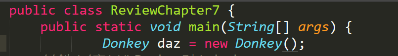

   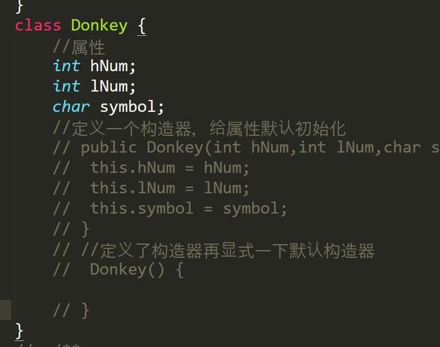

   ​								   默认无参构造器

   使用javap命令反编译一下看看效果

   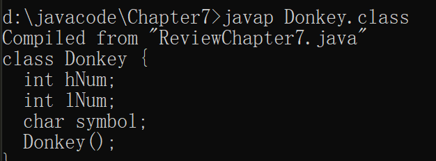

   ​								没有参数的构造器

   **定义一个构造器，原无参构造器就被替代**

   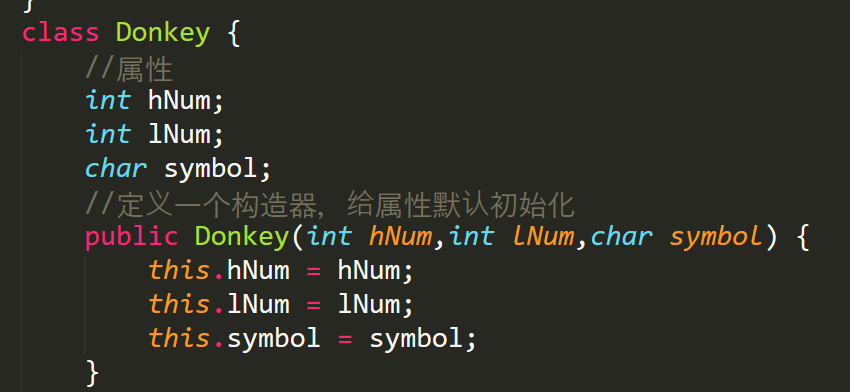

   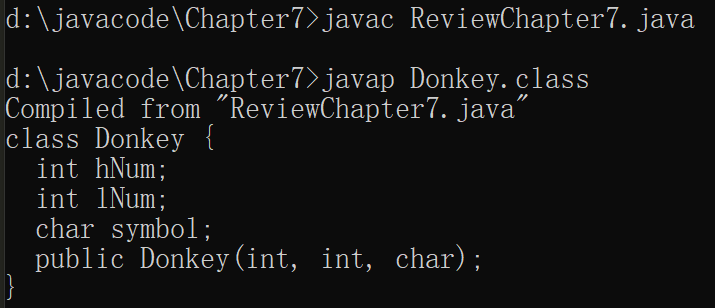

   ​										效果图

   **此时main类要带形参，因为构造器有形参，main类创建对象时会默认调用构造器**

   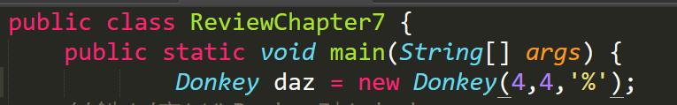

   如果想重新使用构造器，显式定义一下

   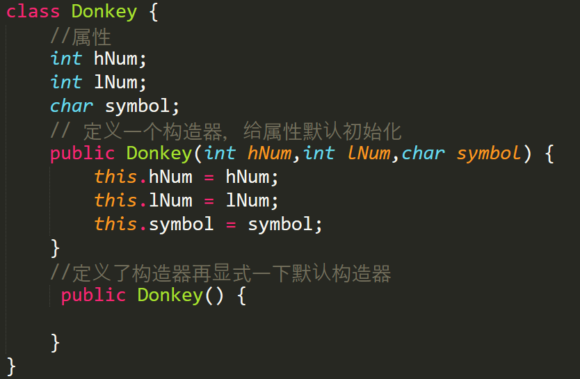

   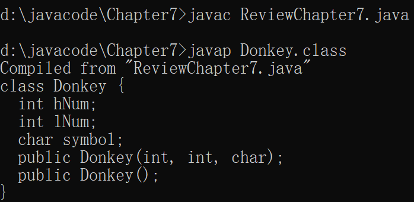

   ​									效果图

   此时main类不用形参

   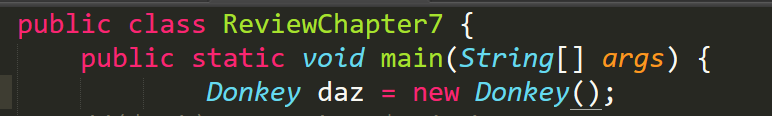

5. 用javap命令将编译好的.class字节码文件，反编译，看到源代码

## 类型转换小steps

如果是值拷贝就可以直接赋值，

char gender  = ‘a’;//a=97

gender = 2;

System.out.println(gender);//输出2这个Unicode码对应的字符

如果是变量之前的赋值先看数据类型，再看范围

char gender = ‘b’;

int age = 17;

gender = age;变量之间的赋值先考虑数据类型能不能实现自动类型转换

int–>gender 大转小 不行！ 除非强制自动类型转换 但会**精度溢出**

好比把一个大象塞进了一个冰箱里

**1.把具体值赋给变量，先考虑范围（满足就不看类****型了），再根据是否满足判断类型。**

**2.把变量赋给变量，直接看类型，int->long (ok)**

**char-->byte(NO)，byte、short 与char没有转换关系******

## 字符串转char

```java
//字符串转char 只能转换字符串的第0（i + 1）,i = 0个字符，
String lo = "123";
System.out.println(lo.charAt(0));
//0代表字符串的下标，0代表第一个数，1代表第二个数，如果（0）写成（3）会提示下标越界，因为根本没有第四个数字
```

## %(取模的本质)

如果被除数属于整形（byte、short、int、long） ***a % b = a - a / b * b***

如果被除数属于浮点型(float、double)   **a % b = a - (int)a / b * b**


## /除法的区别(请加以区分)

在**数学**中 5 / 2 = 2.5

在**Java**中 5 / 2 = 2     int / int = int 后面的浮点数就省略了 因为int型/int型还是int,int是整数


如果这样写的话，在java看来，5/9  《==》 int / int = int ， 5 / 9 = 0 ？ 显然不满足我们数学中 的 5 / 9

所以写5.0 / 9 这样后面的小数就不会被省略了~

## 自增/自减的n种变化形式

假设 int i = 8;

- 作独立成分          i++;      i = i + 1;         i = 8 + 1 = 9;

- 先比较再自增     i++ == 5  先比较i = 8 是否等于 5 不管等于还是不等于 它都自增 i = i + 1 = 9;

- 先相加再自增    i++ + i;     i + i = 16, i++; i = i + 1 = 17

- **先赋值再自增    j = i++;          把i赋值给j    j = 8;  i再自增 i = i + 1; i = 9;(要用到临时变量Temp)**

  ```java
  public class Test { 
      public static void main(String[] args) {
  	int i = 17;
  	int j = 5;
  	i = i--;//要用到临时变量temp
  	System.out.println(i);
      System.out.println(j);
  	}
  }
  ```

  

  ```java
  public class Test { 
      public static void main(String[] args) {
  	int i = 17;
  	int j = 5;
  	i = i--;//要用到临时变量temp
  	System.out.println(i);//17
      System.out.println(j);//5
          j = ++j;
         System.out.println(i);//17
         System.out.println(j); //6
  	}
  }
  ```

  

  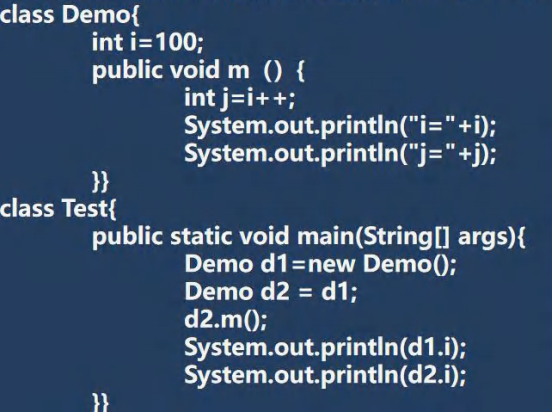

- 先输出再自增  System.out.println(“i = ” + i++);    输出i = 8 然后再自增 i = i + 1 = 9;

## 调用随机数（Random）的两种方法

#### 方法1 ：导入Random类所在的包 new一个random对象，然后接收用户输入可以调整范围，random范围默认为[0.0,1);

1.import java.util.Random;

 2.Random myTools = new Random();

3. int age = myTools.nextInt(); 此时范围为[0 ,1);  

double age = myTools.nextDouble()*100 此时范围为[0 ,99];  

double age = myTools.nextDouble()*100 + 1 此时范围为[0 ,100];  

之后可以随意调整范围

#### 方法2：通过Math类调用random方法

int age = Math.random();  X 错误  double–>int 精度溢出

默认访问为[0.0,1);默认取0.几比如0.64，0.23，……

double–>int 精度大转小，不行除非强制转换，但这个自己是清楚的，强制转换会造成精度溢出

所以使用强转符号 和小括号提升优先级

int age = (int)(Math.random());

Code and examples show

```java
import java.util.Random;//导入Random类所在的包
//Java的类组织形式：包-->类/接口/exception,类-->字段field/成员变量/属性，构造方法，成员方法
public class ReviewChapter4 {
    //编写main方法
    public static void main(String[] args) {
         Random myTools = new Random();
        double age = myTools.nextDouble()*100 + 1;//范围0-100
        int age1 = (int)(Math.random()*1000 + 1);//range ：[0,1000];
        System.out.println("导入包年龄" + " " + age);
        System.out.println("调用Math类年龄" + " " + age1);
    }
}
```

## 有小数参与的运算最后的结果都是近似值

-10.5 % 3 = -10.5 - (int)-10.5 / 3 * 3 = -1.5

最后输出的结果无限接近-1.5，因为结果是double，double属性浮点型，**浮点型的数值都为近似值**

## double n1 = 3d;是允许的

## 巧设方法的返回类型

```
Demand:编写程序，声明 2 个 double 型变量并赋值。判断第一个数大于 10.0，且第 2 个数小于 20.0，打印两数的最大值。
mind：1.define a squirrel class,
 2.define a Double,infer,2 parameter method.
3.use if-else  / Ternary operator structure to describe condition
```

#### 1.方法返回类型为Double，既可以返回多种基本数据类型，还可以返回null（用于判断）

这里定义方法的返回类型可以是void，但我认为**Double**（形参都是double，所以返回类型就**Double类**）更合适

如果满足条件就return Math.max(num1,num2) else { return null;}

然后在main类中调用方法时候用一个variable storage，if(finalRes != null) { 输出它们的最大值 调用print方法} else{

不满足条件，所以不打印它们的最大值}

```java
public class ReviewChapter5 {
    //define a main method
    public static void main(String[] args) {
        Squirrel happyKeep = new Squirrel();
        //since the print method of Squirrel class have return nums,
        // so,we can directly System or use a variable to storage it
            //this is directly system
//         System.out.println(happyKeep.print(27.3,99.5));
            //use a variable to storage it
        Double finalRes = happyKeep.print(27.7,465.8);
        //use if-else structure to filtration
        if(finalRes != null) {
            System.out.println("两数的最大值为" + " " + finalRes);
        }else {
            System.out.println("这两个数不满足条件，所以不打印两数的最大值");
        }
        /**
 * define a class to review Chapter case2
 */
class Squirrel {
    /**
     * define a double,infer,2 parameter method.
     */
    public Double print(double num1,double num2) {
        //method 1 : use if-else structure
//        if(num1 > 10.0 && num2 < 20.0) {
//            return Math.max(num1,num2);
//        }else {
//            return null;
//        }
        //use Ternary operator
        return num1 > 10.0 && num2 < 20.0 ? Math.max(num1,num2) : null;
    }
}
```

#### 2.返回类型为Integer

```java
public class ReviewChapter5 {
    //define a main method
    public static void main(String[] args) {
        //new Monkey oop to use print method
        Monkey happyDay = new Monkey();
        //use a variable to storage it
        Integer returnRes = happyDay.print(121,0);
        //use a if-else structure to filtration
        if(returnRes != null) {
            System.out.println("这俩数的和是"+ " " + returnRes);
        }else {
            System.out.println("未满足条件，不进行输出");
        }
        /**
 * define a Monkey class to review Chapter 5 case3
 */
class Monkey {
    //field..
    //method
    /**
     * define a Integer print 2 parameters method
     */
    public Integer print(int num1,int num2) {
        //define a variable to storage num1 and num2`s sum
        int sum = num1 + num2;
        //use if-else structure
//        if(sum % 3 == 0 && sum % 5 == 0) {
//            return sum;
//        }else {
//            return null;
//        }
        //use Ternary operator
        return sum % 3 == 0 && sum % 5 == 0 ? sum : null;
    }
}
```

New Example

```java
public class ReviewChapter5Exercise {
    //write a main method
    public static void main(String[] args) {
        Panda panda = new Panda(2500000,0.99,65000,200);
        System.out.println("============Second Exercise============");
        //because of  method have return num so we must assign variable or directly system
        //use if-else filtration
        Integer returnRes = panda.inferLeapYear(2004);
        if(returnRes != null) {
            System.out.println(returnRes + " is Leap Year !");
        }else {
            System.out.println("Your Input Year is not Leap Year~");
        }
class Panda {
    /**
     * define a Integer inferYear 0 parameter method
     */
    public Integer inferLeapYear(int year) {
        //define two variable,boolean condition1,condition2
        boolean condition1 = year % 4 == 0 && year % 100 != 0;
        boolean condition2 = year % 400 == 0;
        //use if-else structure to filtration
        if(condition1 || condition2) {
            return year;
        }else {
            return null;
        }
    }
```

## 当注意到题目设计小数的计算时，一定要注意数据类型常量为double

```java
public class ReviewChapter5Exercise {
    //write a main method
    public static void main(String[] args) {
        Panda panda = new Panda(2500000,0.99,65000,200);
        System.out.println("============Four Exercise============");
        double sum = 0;//accumulate sum
        int court = 0;//accumulate plus court
        int max = 210;
        for(int i = 1;i <= max;i++) {//can filtration input max range > 2 && max != null && max != 0
            if(i % 2 != 0) {
                sum += 1.0/i;// must write double tyre because double sum is double
                court++;
            }else {
                sum += -1.0/i;
                court++;
            }
            System.out.println(sum);
            System.out.println("次数 " + court);
        }
```

1. sum这个变量的**数据类型**要是**double**，我们知道，浮点型进行运算时取的都是近似值，如果sum或者数据类型常量是int型的话，那么我进行分数运算时，一般都是0.533323（随便举的栗子），int就会默认取整，所以你输出的结果就是0.

   显然，0并不是我们要求的结果，0.5333323才是。所以我们要注意，当进行浮点型/有小数参与运算时，相应的变量要设置成double型，因为这样更精确，**防止使我们需要的结果丢失**

2. 当有小数进行运算时，代码中相应的数据类型常量要变为double型，例如sum += 1 / i，此时的1 我们知道，默认是int型，如果是int型的话，会把0后面的数舍弃，但我们需要0后面的数，所以就将**1**变成**1.0**，从int–>double,**自动类型转换**，提高了精度，也得到了我们想要的结果

## for循环嵌套中内层循环的特点（难点）

1. 99乘法表，内层      **i <= j**

   ```java
   public class MuitiplyGram {
       //define a main method
       public static void main(String[] args) {
           for(int j = 1;j <= 9;j++) {
               for(int i = 1;i <= j;i++) {
                   System.out.print(j + " * " + i + " = " + j * i + "\t");
               }
               System.out.println();
       }
   }
   }
   ```

2. 求和

   **j <= i**

   ```java
   public class ReviewChapter5Exercise {
       //write a main method
       public static void main(String[] args) {
           Panda panda = new Panda(2500000,0.99,65000,200);
           int sum = 0;
           for(int i = 1;i <= 100;i++) {
               for(int j = 1;j <= i;j++) {
                   sum += j;
               }
           }
           System.out.println("总和为 " + sum);
   ```


## 数组带下标就是基本数据类型，不带下标就是引用数据类型

## 判断对象是否为同一个数据空间的方法

#### 1.使用if-else，如果两个对象 相等就返回true，否则返回false

```java
public class ReviewChapter6 {
    //write a main method
    public static void main(String[] args) {
        System.out.println("==================Var04==================");
//        int[] arr1 = {10,20,30}; 拷贝到 arr2 数组, 要求数据空间是独立的.
        int[] arr1 = {10,20,30};
        int[] arr2 =  new int[arr1.length];
        for(int i = 0; i < arr1.length;i++) {
            arr2[i] = arr1[i];
        }
        for(int i = 0;i < arr2.length;i++) {
            System.out.print(arr2[i] + " ");
        }
        //想判断这俩是不是同一数据空间，两个方法
        //1. 把两个对象 == 看看返回什么，true是同一个对象，false不是同一对象
        if(arr1 == arr2) {
            System.out.println("true");
        }else {
            System.out.println("false");
        }
```


返回false，说明它俩不是同一个数据空间

#### 方法2：通过输出两个对象的hashCode进行比较，如果hashCode相同，则近似认为它们的地址相同

> hashCode:将内部地址通过一系列操作，转成一个码值，可以将这个码值近似认为是对象的地址

```java
import java.util.Scanner;//entry a package of Random class
public class ReviewChapter6 {
    //write a main method
    public static void main(String[] args) {
        System.out.println("==================Var04==================");
//        int[] arr1 = {10,20,30}; 拷贝到 arr2 数组, 要求数据空间是独立的.
        int[] arr1 = {10,20,30};
        int[] arr2 =  new int[arr1.length];
        for(int i = 0; i < arr1.length;i++) {
            arr2[i] = arr1[i];
        }
        for(int i = 0;i < arr2.length;i++) {
            System.out.print(arr2[i] + " ");
        }
        //想判断这俩是不是同一数据空间，两个方法
        //1. 把两个对象 == 看看返回什么，true是同一个对象，false不是同一对象
        if(arr1 == arr2) {
            System.out.println("true");
        }else {
            System.out.println("false");
        }
        //方法2 调用输出两个对象的hashCode，如果相同就近似把它们看成同一数据空间，因为hashCode是内部地址转换的一个码并不是真正的地址
        System.out.println(arr1.hashCode());
        System.out.println(arr2.hashCode());
```


hashCode码值不同，说明它们不是同一个数据空间


## 数组反转（Array Reverse）的两种方法

#### 1.规律法

- 转换次数 = 数组长度（xx.length） /    2

- 用到临时变量temp

  ```java
  public class ReviewChapter6 {
      //write a main method
      public static void main(String[] args) {
          System.out.println("==================Var05==================");
          int[] arr = {11,22,33,44,55,66};
          int temp = 0;//用于辅助交换的临时变量
          for(int i = 0;i < (arr.length / 2);i++) {//i代表交换次数，下标
              temp = arr[i];
              arr[i] = arr[arr.length - i - 1];
              arr[arr.length - i - 1] = temp;
          }
          //for循环遍历输出倒转元素
          System.out.println("=============arr数组倒转情况============");
          for(int i = 0;i < arr.length;i++) {
              System.out.print(arr[i] + " ");
          }
  ```

  

 [错题分析.doc](C:\Users\Admin\Desktop\错题分析.doc) 

#### 2.使用逆序赋值法

- 创建一个新数组

- 双层for循环，外层代表原数组下标，内层代表新数组下标

- 逆序拷贝原数组元素，把原数组下标设置为int i = arr.length-1; i > -1;i - -;新数组下标设置int j = 0;j < arr.length;j++

- **将新数组指向原数组**（题目要求），指向后两个就是同一个数据空间，原数组的数组空间没有变量名指向

  所以就被JVM机销毁了

```java
public class ReviewChapter6 {
    //write a main method
    public static void main(String[] args) {
        System.out.println("==================Var05==================");
        int[] arr = {11,22,33,44,55,66};
        //方法2 逆序赋值
        //创建一个新数组 array
        int[] arraylist = new int[arr.length];
        //for循环遍历arr数组的元素
        for(int i = arr.length - 1;i > -1;i--) {
            for(int j = 0;j < arr.length;j++) {
                arraylist[j] = arr[i];
            }
        }
        //把arrlist指向arr，因为我求的是arr的倒序数组
        arr = arraylist;
        System.out.println("")
        for(int j = 0;j < arr.length;j++) {
            System.out.print(arr[j] + " ");
        }
```

如果我就是想看看这俩对象是真的为同一个数据空间怎么办？

- ##### 使用if-else，通过对象1 == 对象2 ，满足条件返回true，否则返回false

  如果返回true说明，对象1和对象2是同一数据空间，反之则不是

- ##### 输出两个对象的hashCode，如果两个对象的hashCode方法相同就说明是同一数据空间，反之则不是

[判断两个对象是否为同一数据空间的方法（详细）](##数组带下标就是基本数据类型，不带下标就是引用数据类型)

## 将无序数组转换成有序数组

##### 1.冒泡排序

#### 定义：将无序数组转换成有序数组

#### 规律

- 每次选出一个数
- 外层for循环是轮数，**轮数 = 数组长度-1**；内层for循环是输出个数，**输出个数 = 数组长度-1-i**
- 从小到大或者从大到小排
- **交换的下标是内层循环下标**

##### 从小到大排

- 如果前面的数大于后面的数就交换

##### 从大到小排

- 如果前面的数小于后面的数就交换

```java
//        下面我们举一个具体的案例来说明冒泡法。我们将五个无序：24,69,80,57,13 使用冒泡排序法将其排成一个从小到大的有
//                序数列
        /*
        思路分析
        1. 通过静态初始化，定义一个数组arr
        2. 从小到大排序，如果前面数大于后面数就交换
        3. 定义一个用于辅助交换的临时变量temp
        4. 根据冒泡排序的规律，外层for循环是轮数，轮数为 arr.length - 1
           内层for循环是次数，次数为 arr.length-1-i
         */
        int[] arr = {24,69,80,57,13};
        int temp = 0;//用于辅助交换的临时变量
        //for循环遍历arr数组元素
        for(int i = 0;i < arr.length-1;i++) {//i代表轮数
            for(int j = 0;j < arr.length-1-i;j++) {//j代表输出次数
                //if单分支过滤
                if(arr[j] > arr[j + 1]) {
                //从小到大排：arr[j] > arr[j + 1]；从大到小排： arr[j] < arr[j + 1]
                    temp = arr[j];
                    arr[j] = arr[j + 1];
                    arr[j + 1] = temp;
                }
            }
        }
        //for循环遍历输出
        for(int i = 0;i < arr.length;i++) {
            System.out.print(arr[i] + " ");
        }
```

#### 推导过程


- **冒泡排序输出**，for循环遍历输出的是交换后的数组，轮数不用再遍历输出，因为数组元素已经交换好了

  ```java
   public static void main(String[] args) {
          System.out.println("==================Homework6==================");
          //定义一个无序数组，将其变成一个有序数组
          int[] arr = {12,-1,232,-11,234};
          //要求从大到小排序
          //定义一个临时变量temp
          int temp = 0;
          //for循环遍历数组元素
          for(int i = 0;i < arr.length-1;i++) {//i代表轮数
              for(int j = 0;j < arr.length- 1 - i;j++) {//j代表每轮次数
                  if(arr[j] > arr[j + 1]) {
                      temp = arr[j];
                      arr[j] = arr[j + 1];
                      arr[j + 1] = temp;
                  }
              }
          }
          //for循环遍历数组元素
              for(int j = 0;j < arr.length;j++) {//i也行，轮数不用输出，因为已经在上面已经完成交换了
                  System.out.print(arr[j] + " ");
              }
  ```

  PLUS 版 2024/7/16
  
  ```java
  public class testpro01 {
      //编写main方法
      public static void main(String[] args) {
          Mytools mas = new Mytools();
          //创建int数组（静态初始化）
          int[] arr = {23,44,-12,55,222,-5};
          int[] returnRes = mas.bubbleSorting(arr);
          System.out.println();//换行
  //        方法1：if-else判断是否同一数据空间
          if(returnRes == arr) {
              System.out.println("它俩是同一数据空间");
          }else {
              System.out.println("它俩不是同一数据空间");
          }
          //方法2：通过输出它们的hashCode看看是不是同一数据空间
          System.out.println("arr数组的hashCode " + arr.hashCode());
          System.out.println("arrNew数组的hashCode " + returnRes.hashCode());
      }
  }
  class Mytools {
      /*
      要求拷贝原数组元素到新数组，新数组元素长度是原来长度-1
      要求倒序遍历新数组元素，并使用冒泡排序，最后在main类判断两个数组是否为同一个数据空间
       */
      //方法返回类型 void 方法名 bubbleSorting 方法形参 int[] arr
      public int[] bubbleSorting(int[] arr) {
          //定义个临时变量temp用于交换元素
          int temp = 0;
             int[] arrNew = new int[arr.length - 1];
          //for循环遍历原数组元素
          for(int i = 0;i < arrNew.length;i++) {
              //数组拷贝
              arrNew[i] = arr[i];
          }
          //for循环倒序遍历新数组
      for(int i = 0;i < arrNew.length-1;i++) {
              for(int j = 0;j < arrNew.length- 1 - i;j++) {
                  //从大到小排序
                  if(arrNew[j] < arrNew[j + 1]) { //注意这里的arrNew别写成arr
                    temp = arrNew[j];
                    arrNew[j] = arrNew[j + 1];
                    arrNew[j + 1] = temp;
              }
          }
      }
      //for循环倒序输出数组元素
      for(int i = arrNew.length-1;i > -1;i--) {
          System.out.print(arrNew[i] + " ");
      }
      return arrNew;
  }
  }
  ```
  

##### 字符串长度排序

- 从小到**大**排

  如果前面的**字符串长度**  >  **后面的字符串长度** 就交换

- 从大到**小**排

  如果前面的**字符串长度**  < **后面的字符串长度** 就交换

```java
 public void bubbleSorting(Person[] people) {
        //定义一个临时变量temp
        Person temp = null;
        //for循环遍历数组
        for (int i = 0; i < people.length - 1; i++) {
            for (int j = 0; j < people.length - 1 - i; j++) {
                //字符串大小，从大到小排序
                //从小到大排序：people[j].getName().length() > people[j + 1].getName().length()
                if(people[j].getName().length() < people[j + 1].getName().length()) {
                    temp = people[j];
                    people[j] = people[j + 1];
                    people[j + 1] = temp;
                }
            }
        }
        for (int i = 0; i < people.length; i++) {
            System.out.println(people[i]);//输出对象默认调用toString方法，所以在子类重写toString方法
        }
    }
```


##### 2.调用Java util(工具包) 下Arrays类,对数组进行排序

**使用方法**

- **创建一个数组**
- **调用Arrays.sort()方法，将数组作为实参传入方法内**
- Arrays.sort(arr)
- for**循环遍历输出数组元素**

```java
package com.areso.pkg;
import java.util.Arrays;
public class Import01 {
    public static void main(String[] args) {
//        //需求：将一个无序数组-->有序数组
//        //方法1：传统方法：冒泡排序
//        int temp = 0;
//        int[] arr = {20,-23,12,'a',99};
//        for (int i = 0; i < arr.length - 1; i++) {//i代表轮数
//            for (int j = 0; j < arr.length - 1 - i; j++) {
//                  if(arr[j] > arr[j + 1]) {
//                      temp = arr[j + 1];
//                      arr[j + 1] = arr[j];
//                      arr[j] = temp;
//                  }
//            }
//        }
//        //for循环遍历输出排序后的数组元素
//        for (int i = 0; i < arr.length; i++) {
//            System.out.print(arr[i] + " ");
//        }
//    }
        //新方法：调用java util 包中的 Arrays 实现排序
        int[] arr = {20,-23,12,'a',99};
        System.out.println("=========排序前数组情况=========");
        for (int i = 0; i < arr.length; i++) {
            System.out.print(arr[i] + " ");
        }
        Arrays.sort(arr);
        //for循环遍历输出排序后数组情况
        System.out.println("\n" + "=========排序后数组情况=========");
        for (int i = 0; i < arr.length; i++) {
            System.out.print(arr[i] + " ");
        }
    }
}
```


## 查找顺序查找

​	按顺序查找

```java
import java.util.Scanner;
public class SequenceSearch {
    //编写main方法
    public static void main(String[] args) {
          /*
        思路分析
        1. 定义一个字符串数组，下标
        2. for循环遍历数组元素
        3. 如果用户输入的 和 遍历元素相同，提示找到 数组元素
        4. 输出下标值
         */
        //创建Scanner对象 myTools
        Scanner myTools = new Scanner(System.in);
        //创建一个字符串数组
        String[] arr = {"高野千鹤","初音","星野爱","五条悟","夏油杰"};
        //定义一个下标
        int index = 0;
        //提示用户输入
        System.out.println("请输入一个字符串");
        //接收用户输入
        String userInput = myTools.next();
        //for循环遍历arr数组元素
        for(int i = 0;i < arr.length;i++) {
            if(arr[i].equals(userInput)) {//字符串相等要用equals
                //如果不等 <==> !arr[i].equals(userInput)
                System.out.println(arr[i]);
                index = i;
                System.out.println("下标为 " + index);
                break;//找到就退出for循环
            }
        }
    }
}
```


- ##### **二分查找**

  假设一个中间数middleNum 如果中间数和输入数相等 输出存在此数 不等
  	如果输入数 > 中间数 向右查找-->利用下标
  	如果输入数 < 中间数 想左查找

```java
import java.util.Scanner;
public class TwoSequenceSearch {
    //编写main方法
    public static void main(String[] args) {
        /*
        二分查找
        假设一个中间数middleNum = arr.length / 2
         如果中间数和输入数相等 输出存在此数 不等
        如果输入数 > 中间数 向右查找-->利用下标
        如果输入数 < 中间数 想左查找
        思路分析
        1. 假设一个中间数middleNum = arr.length / 2
        2. 三种情况：
           1. 输入的数刚好等于中间数
           2. 输入的数大于中间数，向右查找，for循环，i变量初始化为中间数，以arr.lentgh结束，i++
           3. 输入的数小于中间数，向左查找，for循环，变量初始化为中间数，以j > -1结束，j--
         */
        //定义一个下标
        int index = -1;//用于输出找到下标和判断是否查询到输入的数
        //创建Scanner对象 myTools
        Scanner myTools = new Scanner(System.in);
        //创建一个字符串数组
        int[] arr = {-23,45,18,50,55,90,798,454,2077};
        //提示用户输入
        System.out.println("请输入一个数字[-40,2100]");
        //接收用户输入
        int userInput = myTools.nextInt();
        //for循环遍历arr数组元素，使用if-else 过滤输入的范围
        if(userInput > -40 && userInput < 2100) {
            System.out.println("===========正在判断输入数是否等于中间数，不等继续判断============");
            label1:     for(int i = 0;i < arr.length;i++) {
                //定义一个中间数
                int middleNum = arr[arr.length / 3];
                //情况1：输入数 == 中间数
                if(userInput == middleNum ) {
                    System.out.println("输入的数刚好等于中间数 " + middleNum + " 下标为 " + i);
                    index = i;
                    break;
                }
                else if(userInput > middleNum) {
                    int court = 0;
                    //情况2：输入的数 > 中间数,向右查找
                    for(int j = (arr.length / 3) + 1 ;j < arr.length;j++) {
                        System.out.println("=========正在向右查找========");
                        if(userInput == arr[j]) {
                            System.out.println("向右查找找到了相同的数 " + arr[j] + " 下标为 " + j);
                            index = j;
                            court++;
                            System.out.println("共查找了 " + court + " 次");
                            break label1;
                        }
                        court++;
                    }
                    System.out.println("=============向右查找完毕========= 已查找 " + court +" 次");
                    break;
                }
                if(userInput < middleNum){
                    int court = 0;
                    for(int z = (arr.length / 3) - 1;z > -1;z--) {
                        System.out.println("=========正在向左查找========");
                        if(userInput == arr[z]) {
                            System.out.println("向左查找找到了相同的数 " + arr[z] + " 下标为 " + z);
                            index = z;
                            court++;
                            System.out.println("共查找了 " + court + " 次");
                            break label1;
                        }
                        court++;
                    }
                    System.out.println("=============向左查找完毕========= 已查找 " + court +" 次");
                    break;
                }
            }
        }else {
            System.out.println("您输入的数字超过了[-40,2100]的范围,请稍后重试");
        }
        if(index == -1) {
            System.out.println("数组中没有输入的数");
        }
    }
}
```

## 两个经典编程思想（if-else）

##### index的运用(else)

- 定义一个下标 int index = -1;
- 如果满足条件，就把值下标赋给index，  index = z
- 然后在方法体最后输出index的值，如果index != -1，说明满足xx条件，反之则不满足该条件

```java
import java.util.Scanner;
public class TwoSequenceSearch {
    //编写main方法
    public static void main(String[] args) {
        /*
        需求：输入的数和数组元素相同，就提示数组有相同元素，如果数组没有输入的元素，就输出数组没有该元素
        */
        //静态初始化，创建一个String数组
        String[] arr = {"樱岛麻衣","新一","懒洋洋","黑大帅"};
        //定义一个下标
        int index = -1;
        //创建Scanner对象
        Scanner myTools = new Scanner(System.in);
        //提示用户输入
        System.out.println("请输入一个字符串");
        //接收用户输入
        String userInput = myTools.next();
        //for循环遍历arr数组元素
        for(int i = 0;i < arr.length;i++) {
            //使用if单分支过滤
            if(arr[i].equals(userInput)) {//字符串相等用equals
                System.out.println("数组找到了输入的元素 " + arr[i]);
                index = i;
                //找到了就break，退出for循环节省内存
                break;
            }
        }
        //看看index值，如果是-1说明没找到
        if(index == -1) {
            System.out.println("数组中没有找到输入的元素 " + userInput);
        }
    }
}
```

##### Double/Interger…包装类的运用

- 主要运用在非main类的方法中，**Double/Integer**作为方法的返回类型，即可以返回**基本数据类型**，也可以返回**null**

- if-else,中表示不满足的情况很适用，不满足条件就返回**null**

- 在main类调用该方法，用变量来存储调用的方法(因为方法有返回值，且我还要用if进行判断)，

  if(变量 != null)说明满足条件，else 不满足条件

  [返回包装类（详细）](##巧设方法的返回类型)

## 二维数组注意事项

1. 二维数组的每一个元素都是一维数组，其对应的一维数组又有相应的元素，所以需要**遍历两次**

2. arr[i] [j] 第 i + 1个一维数组，第j + 1 个一维数组的值

3. arr.length 代表二维数组的元素长度（二维数组有多少个一维数组）

4. arr[i].length 代表二维数组中的一维数组有多少个元素

   #### 底层运行原理图（要求自己能随意说出）

   

​									    底层原理	

##### 三种表达方式

- 静态初始化(元素较少)

  

  ​									    分析图

  

- 动态初始化(已经列数)

  

  ​										分析图

  

- 动态初始化(列数未知)

  

  ​										分析图


## 已知升序数组，要求插入一个元素，使原数组仍为升序

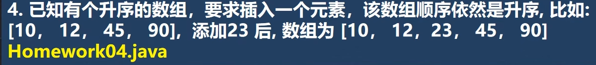

**思路**

1. 找插入数组的下标

2. 扩容原数组（长度为原数组+1），拷贝arr数组元素至arrNew，for循环遍历，跳过插入的数组复制

3. 当新数组下标为找到的index时，把插入数赋给arrNew[j]

4. **使用内存分析法**

   **注意事项**

   - **找到插入下标后就break**，不然会把最大值赋给index，不满足需求
   - 注意原数组下标的循环变量迭代i++,**当index == j(arrNew下标)，原数组下标不会执行循环变量迭代**

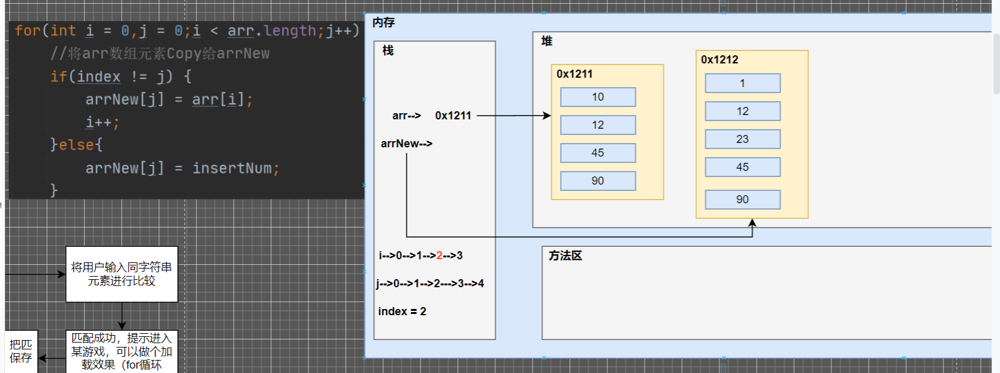
									    内存分析图

[流程图Homework04Gram.iodraw](D:\IoXmind\)

原思路

```java
public class ReviewChapter6 {
    //write a main method
    public static void main(String[] args) {
        System.out.println("==================Homework4==================");
        //创建原始数组arr
        int arr[] = {10,12,45,90};
        //设置一个插入数变量
        int insertNum = 23;
        //设置一个下标
        int index = -1;//用于查找插入数组的下标
        //for循环遍历arr数组元素
        for(int i = 0;i < arr.length;i++) {//i代表arr数组下标
            //使用if单分支与遍历元素进行匹配
            if(insertNum < arr[i]) {
                index = i;
            }
        }
        System.out.println("要插入的数组的下标为 " + index);
        //创建新数组
        int arrNew[] = new int[arr.length + 1];//开辟空间，没赋值，默认初始化，加载默认值
        //for循环变量arr数组元素
        for(int i = 0;i < arr.length;) {
            //将arr数组元素Copy给arrNew
            if(index != j) {
                arrNew[i] = arr[i];
                i++;
            }else{
                arrNew[i] = insertNum;
            }
        }
        //求的arr数组升序数组，所以让arrNew指向arr
        arr = arrNew;
        //for循环遍历输出arr数组情况
        for(int i = 0;i < arr.length;i++) {
            System.out.print(arr[i] + " ");
        }
```

---

如若忘记，请重新思考再看demo

---

```java
public class ReviewChapter6 {
    //write a main method
    public static void main(String[] args) {
        System.out.println("==================Homework4==================");
        //创建原始数组arr
        int arr[] = {10,12,45,90};
        //设置一个插入数变量
        int insertNum = 23;
        //设置一个下标
        int index = -1;//用于查找插入数组的下标
        //for循环遍历arr数组元素
        for(int i = 0;i < arr.length;i++) {//i代表arr数组下标
            //使用if单分支与遍历元素进行匹配
            if(insertNum < arr[i]) {
                index = i;
                break;//找到下标就退出for循环，不然会把90位置占了
            }
        }
        System.out.println("要插入的数组的下标为 " + index);
        //创建新数组
        int arrNew[] = new int[arr.length + 1];//开辟空间，没赋值，默认初始化，加载默认值
        //for循环变量arr数组元素
        for(int i = 0,j = 0;i < arr.length;j++) {
            //将arr数组元素Copy给arrNew
            if(index != j) {
                arrNew[j] = arr[i];
                i++;
            }else{
                arrNew[j] = insertNum;
            }
        }
        //求的arr数组升序数组，所以让arrNew指向arr
        arr = arrNew;
        //for循环遍历输出arr数组情况
        for(int i = 0;i < arr.length;i++) {
            System.out.print(arr[i] + " ");
        }

```

##### 2.拓展：已知升序数组，要求插入一个元素，后为降序数组

**方法：按插入元素，仍为升序的要求，求出下标，然后倒序输出**

```java
创建原始数组arr
        int arr[] = {10,12,45,90};
        //设置一个插入数变量
        int insertNum = 23;
        //设置一个下标
        int index = -1;//用于查找插入数组的下标
        //for循环遍历arr数组元素
        for(int i = 0;i < arr.length;i++) {//i代表arr数组下标
            //使用if单分支与遍历元素进行匹配
            if(insertNum < arr[i]) {
                index = i;
                break;//找到下标就退出for循环，不然会把90位置占了
            }
        }
        System.out.println("要插入的数组的下标为 " + index);
        //创建新数组
        int arrNew[] = new int[arr.length + 1];//开辟空间，没赋值，默认初始化，加载默认值
        //for循环变量arr数组元素
        for(int i = 0,j = 0;i < arr.length;j++) {
            //将arr数组元素Copy给arrNew
            if(index != j) {
                arrNew[j] = arr[i];
                i++;
            }else{
                arrNew[j] = insertNum;
            }
        }
        //求的arr数组升序数组，所以让arrNew指向arr
        arr = arrNew;
        //for循环遍历输出arr数组情况
        for(int i = arr.length-1;i > -1;i--) {
            System.out.print(arr[i] + " ");
        }
```


- [ ] 复习BitOperator
  - [ ] 读书10分钟

:smile:

## for循环查找最优解

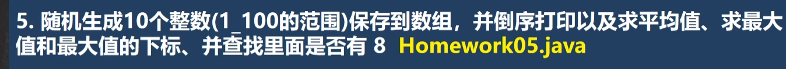

思路分析

```
1. 动态初始化，创建int型一维数组(不知道值，而且值有10个，不可能用静态初始化)
2. for循环遍历数组元素，把随机生成的元素赋给遍历元素
3. 定义int型sum变量，用于累积数组元素的和，题目有10个数，所以平均数 sum / 10
4. 定义一个int maximum,index变量，用于辅助计算最大值，假设max = arr[0],for循环从1开始遍历
   if(max < arr[i]) 说明不是最大值，max = arr[i],index = i 不用break，因为我们要找的是最大值
   如果找到就break很有可能找到的是第二的大或者第三大的数
5. 键盘输入，if(userInput == arr[i]) {court++ break}
```

这道题两个注意点

- for循环遍历元素，与假定的最大值比较的时候**不能一找到 max < arr[ i] 的就直接break**

  会误将第二大，或者第三大的数，保存至最大值不满足题意

```java
//================栗子1======================不能break
int arr[] new int[10];
//for循环遍历保存元素
for(int i = 0;i < arr.length;i++) {
arr[i] = (int)(Math.random()*100) + 1
}
int max = arr[0];
int index = 0;
假设数组是{12,-12,23,45,60 ......省略}
for(int i = 1;i < arr.length;i++) {
if(max < arr[i]) {// ====找到比12大的值了===
  max = arr[i];
  //break;
  如果此时break，那我们算的“最大值”就是23，这对吗？
  显然不对，所以我们这不能break
//==========================栗子2====================必须break
   升序查找，插入一个数，使数组仍为升序
      先找插入下标，重点！
   //创建原始数组arr
        int arr[] = {10,12,45,90};
        //设置一个插入数变量
        int insertNum = 23;
        //设置一个下标
        int index = -1;//用于查找插入数组的下标
        //for循环遍历arr数组元素
        for(int i = 0;i < arr.length;i++) {//i代表arr数组下标
            //使用if单分支与遍历元素进行匹配
            if(insertNum < arr[i]) {
                index = i;
                break;//找到下标就退出for循环，不然会把45位置占了
                如果我们这里不break，会出现什么情况，我们来看看
                 如果不break，我们原本要求的是 2 这个下标
                    不break，通过for循环，我们的下标就变成 3 了
                    因为 arr[3] 也大于 insertnum,
                但回归题目，我们要求的是升序，那必然不能让插入的数取代最大数的位置
                  不然就会变成这样{10,12,45,23,90}
                 明显和我们预期的 {10,12,23,45,90}不同，
                    所以当我们在这里找到下标就一定要break
            }
        }
}
}
```

- 在for循环中查找，可以巧用index/court，总之随便设置一个变量，如果满足查找条件，**就court++，然后break**

  已经找到输入的元素就要break，因为已经找到就没必要继续遍历数组的元素了

  - for循环结束后，使用**if-else**进行判断，数组中是否找到输入的元素

  ```java
   //创建Scanner对象myTools
          Scanner myTools = new Scanner(System.in);
          //提示用户输入
          System.out.println("请输入你要查找的数");
          //接收用户输入
          int userInput = myTools.nextInt();
          int arr[] = new int[10];
          //for循环遍历数组元素
          for(int i = 0;i < arr.length;i++) {
              //将随机数保存到int数组中
              arr[i] = (int)(Math.random()*100) + 1;
          }
          //定义两个变量，sum，maximum，index
          int sum = 0;
          int maximum = arr[0];
          int index = 0;
          int court = 0;//用于判断是否查到到输入元素
          //for循环遍历数组元素
          System.out.println("\n" + "=============原数组情况==============");
          for(int i = 0;i < arr.length;i++) {
              System.out.print(arr[i] + " ");
              sum += arr[i];//和的累积
              if(i > 0) {
                  if(maximum < arr[i]) {
                      maximum = arr[i];
                      index = i;
                  }
              }
              if(userInput == arr[i]) {
                  court++;
                  break;
              }
          }
          //if-else双分支判断是否查到到输入元素
          if(court != 0) {
              //说明数组中有输入的元素
              System.out.println("\n" + "数组中有输入的元素 "+ userInput);
          }else {
              System.out.println("\n" + "数组中没有输入的元素 ");
          }
          System.out.println("\n" + "平均值 " + sum / 10);
          System.out.println("最大值为  " + maximum + " " + "下标 " + index);
          //for循环倒序输出数组元素
          System.out.println("\n" + "=============倒序输出数组情况==============");
          for(int i = arr.length-1;i > -1;i--) {
              System.out.print(arr[i] + " ");
          }
  
  ```

  

> 长路漫漫亦灿灿

> 你才大一已经有这种决心，真的很厉害，继续加油吧。

> 抓住专升本的机会 不然找工作会很难

>  一定要加油啊！！！ 你一定能成功的！！！

> “今天是24年的1月15日，我开学是大一下学期。初次接触IT行业，选的是计算机应用技术。真的很有趣。我想在热爱中工作。虽然我读的只专科，虽然我不是天才。尽管如今很多人，很多公司用学历去衡量一个人，不否认这是一个赛选大量人的低成本高效的方法。可这样会淹没一部分人才，虽然数量可能不多。但他们都值得发光，可以去发光。我就是要用实力去证明。IT行业技术不局限于学历，人才不限于本科往上。而我目前所要做的，就是拿下24年4月的蓝桥杯JAVA方向大学生C组的一等奖，明年我要拿下国赛的奖！努力是超越不了努力的天才，但可以超越不努力的天才，可以超越懈怠的天才，至少不至于沉入海底。很多人，他或许很聪明，他不是没实力，可能局限于了他不能自律，可能局限于了他的生活环境等很多外部因素。在这个人多量大的时代。大家都在同一个屋檐下，听同一个老师的课，但却在残忍的竞争着，没有人愿意让别人从自己身上踏过去，让自己血肉模糊。努力不一定会成功，不一定会出人头地。但努力就够了，但努力就对了，不一定，但一定不会是绝对。而不努力那就绝对没落。 阿玮老师的课真的很精彩，从题目的设计等，都可以老师们备课的良苦用心，不管这课的最终目的是什么。至少它是免费的、至少它是完整的、用心的、它让我们不需要付费，它让我们可以站在同一个起跑线，它可以救起很多人！ 不管结局如何，人要懂得感恩，尽管现在我只能用言语去表达感激之情。在此由衷的感谢阿玮老师这么久以来的辛苦付出，阿玮应该也很年轻，希望他可以一生光彩灿烂，所遇皆良人，一生无疾病，一生平安。也很感谢传智教育，黑马的用心栽培，愿贵司一路长红，永垂不朽，深得人心 目前我也仍在学习中，现在是寒假期间。看到了126级，我还会继续坚持，把下篇也看完。有始有终，希望可以和各位正在学习或者已经学习完的同志一起成长，一起努力，一起辉煌！加油各位！，祝你也祝我..... 2024.1.15 冬 大一寒假”
>
> ​																		 —黑马程序员评论区

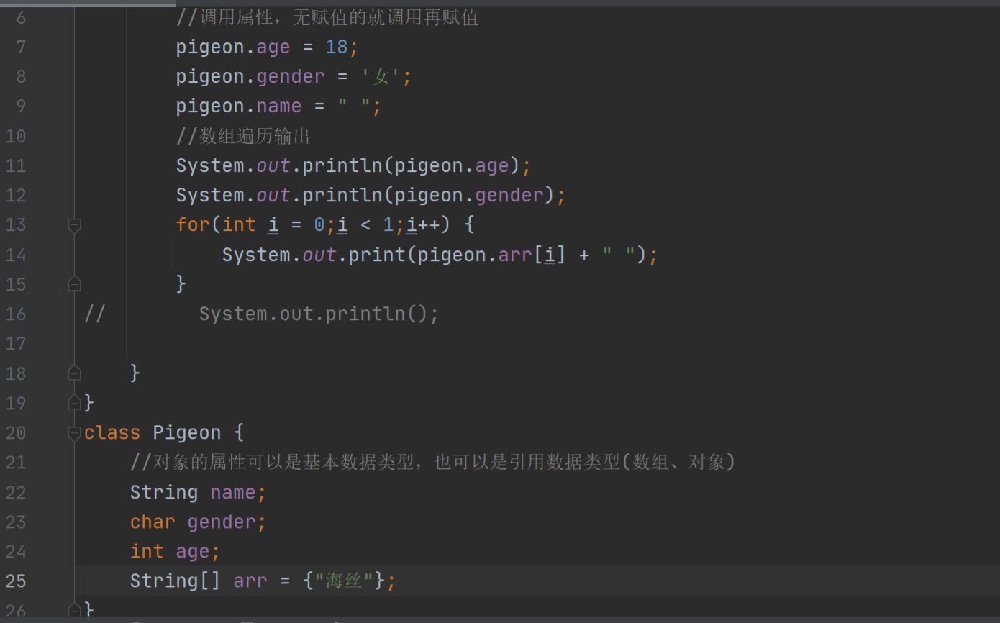

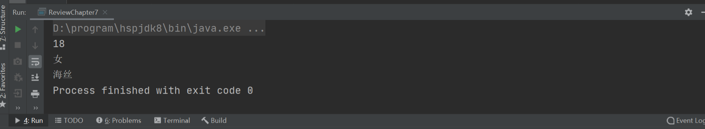

## 对象的属性可以是基本数据类型，也可以是引用数据类型(数组、对象)

##### 1.属性是对象时调用方法

- 无赋值

  1. 给一维数组开辟空间

  2. 给一维数组的元素赋值

  3. for循环遍历输出ArrNew数组元素

     ```java
     		//创建一个Pigeon对象
             Pigeon pigeon = new Pigeon();
     		//给一维数组开辟空间
             pigeon.arrNew = new int[3];
             //给数组赋值
             pigeon.arrNew[0] = 12;
             pigeon.arrNew[1] = 23;
             pigeon.arrNew[2] = -7;
             //for循环遍历数组元素
             for(int i = 0;i < 3;i++) {
                 System.out.println(pigeon.arrNew[i] + " ");
             }
     class Pigeon {
         //对象的属性可以是基本数据类型，也可以是引用数据类型(数组、对象)
         int[] arrNew;
     }
     ```

     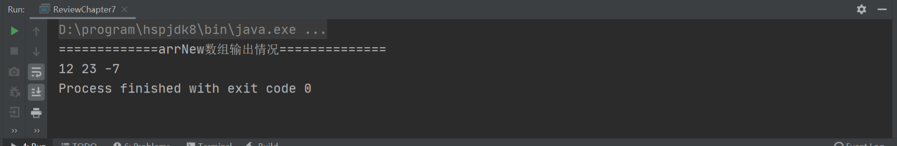

- 已赋值(for循环遍历调用)

  ```java
  public class ReviewChapter7 {
      //编写main方法
      public static void main(String[] args) {
          //创建一个Pigeon对象
          Pigeon pigeon = new Pigeon();
          //for循环遍历数组元素
          for(int i = 0;i < 2;i++) {
              System.out.println(pigeon.arr[i] + " ");
          }
  class Pigeon {
      //对象的属性可以是基本数据类型，也可以是引用数据类型(数组、对象)
      String[] arr = {"海丝","高中生"};
  ```

  

  - 在main类for循环遍历输出数组元素

## 对象的属性拷贝

```java
class Person{
    char gender;
}
class Handsome {
public void copyPerson(Person person) {//copyPerson的形参person和Person地址相同，因为它们之间是地址拷贝
		Person purz = new Person();//新创建一个person对象，它们地址就不同了
		purz.gender = person.gender;//属性拷贝
	}
}
```

## 匿名对象的使用（使用过一次就会被销毁（其在堆中的数据空间）因为没有对象名指向它）

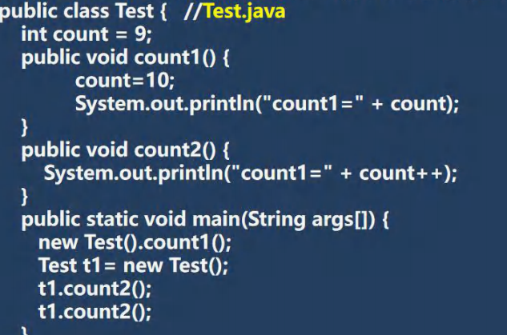

## 对象调用方法精髓

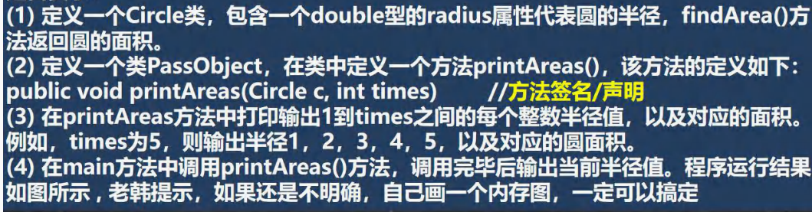

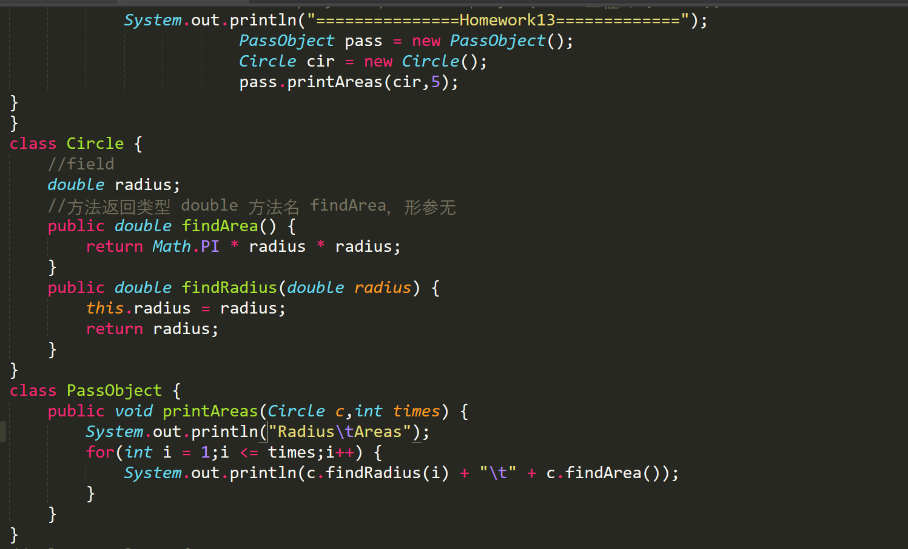

原方法

```java
public class ReviewChapter7 {
	public static void main(String[] args) {
        System.out.println("===============Homework13============="); 
	 					PassObject pass = new PassObject();
	 					Circle cir = new Circle();
	 					pass.printAreas(cir,5);
}	
}
class Circle {
	//field
	double radius;
    //定义构造器
    public Circle(double radius) {//发现要求是输出多个半径，而构造器只能输出一个半径所以不用构造器了
        this.radius = radius;
    }
    //显式默认无参构造器
    public Circle() {
        
    }
	//方法返回类型 double 方法名 findArea，形参无 //把算半径的方法形参变成radius
	public double findArea(//double radius//) {
		return Math.PI * radius * radius;
	}
	public double findRadius(double radius) {
		this.radius = radius;
		return radius;
	}
}
class PassObject {
	public void printAreas(Circle c,int times) {
		System.out.println("Radius\tAreas");
		for(int i = 1;i <= times;i++) {
			System.out.println(i + c.findArea(i));
            //并没有很合题目的用对象调用方法
		}
	}
}
```

**最优解**

```java
public class ReviewChapter7 {
	public static void main(String[] args) {
        System.out.println("===============Homework13============="); 
	 					PassObject pass = new PassObject();
	 					Circle cir = new Circle();
	 					pass.printAreas(cir,5);
}	
}
class Circle {
	//field
	double radius;
	//方法返回类型 double 方法名 findArea，形参无
	public double findArea() {
		return Math.PI * radius * radius;
	}
	public double findRadius(double radius) {
		this.radius = radius;
		return radius;
	}
}
class PassObject {
	public void printAreas(Circle c,int times) {
		System.out.println("Radius\tAreas");//注意转义字符的使用
		for(int i = 1;i <= times;i++) {
			System.out.println(c.findRadius(i) + "\t" + c.findArea());
		}
	}
}
```

## 包区分相同的类

##### 1.一个导入包，另一个要输出包名

xiaoming想取Dog类，xiaoqiang也取Dog类，它们在不同的包中

import com.xiaoming.Dog

Dog dog = new Dog();//此时的Dog指的是xiaoming包中的Dog类

此时的Dog也可以写成com.xiaoming.Dog,编译通过

但上面已经导入com.xiaoming包的Dog类了，就不用再写包名了

错误示范

​	如果此时仍写Dog dog = new Dog()，计算机就会认为，这个Dog类是xiaoming的Dog类

**但包是区分相同的类，所以我们要把xiaoqiang的包名打出来**

正确示范

​	com.xiaoqiang.Dog dog = new com.xiaoqiang.Dog();

```java
package com.use;

import com.xiaoqiang.Dog;

public class test {
    public static void main(String[] args) {
        Dog dog = new Dog();
//        com.xiaoqiang.Dog dog = new com.xiaoqiang.Dog();
        System.out.println(dog);
        com.xiaoming.Dog dog1 = new com.xiaoming.Dog();//必须写包名，不然计算机无法区分
        System.out.println(dog1);//会错认为是xiaoqiang包中的Dog类
    }
}
```

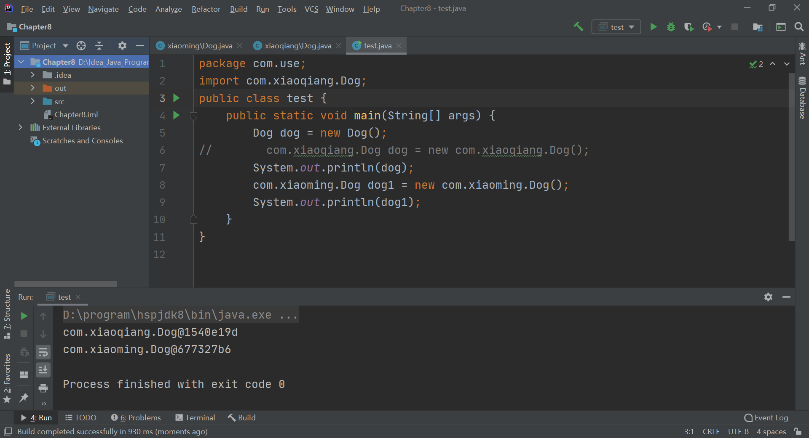


##### 2.不导入包两个都输出包名

```java
package com.use;
public class test {
    public static void main(String[] args) {
        com.xiaoqiang.Dog dog = new com.xiaoqiang.Dog();
        System.out.println(dog);
        com.xiaoming.Dog dog1 = new com.xiaoming.Dog();
        System.out.println(dog1);
    }
}
```

编译通过

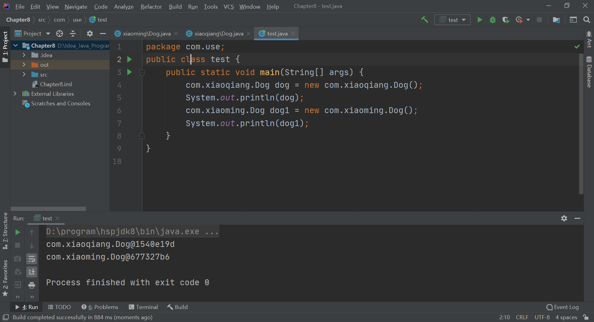

## 范围修饰符范围（必须背下来）

|   名称    | 本类 | 同包 | 子类 | 不同包 |
| :-------: | :--: | :--: | :--: | :----: |
|  public   |  √   |  √   |  √   |   √    |
| protected |  √   |  √   |  √   |   ×    |
|   默认    |  √   |  √   |  ×   |   ×    |
|  private  |  √   |  ×   |  ×   |   ×    |

## 哪个对象调用this，this就指哪个对象

## 封装案例

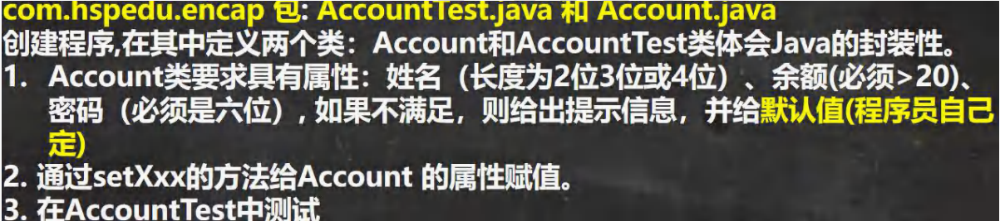

**封装步骤**

- **对属性私有化**（使属性的数据类型是private(只能在本类调用)）

- **定义一个set属性的方法**，进行**业务逻辑**的判断（密码长度必须为6位，姓名的长度大于2，小于4，性别必须是男/女），再**给属性赋值**

- 还可以把set属性的方法放到构造器中给属性赋值

  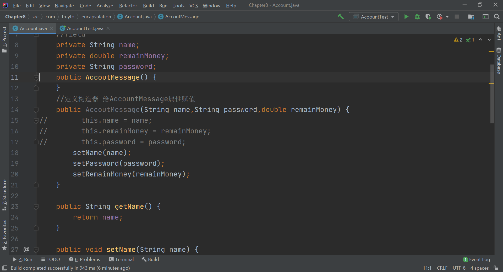

- **定义一个get属性方法**，进行**权限**（如果密码 == 231212，如果hashcode码  == …）的判断，再**得到属性的值**

思路分析：

1. 要封装，说明属性要私有化；

2. 通过Alt + Insert 快捷键 生成 set and get 方法

3. 姓名长度2-4、余额大于20、密码必须6位，明显是业务逻辑，所以在相应的set方法中过滤

4. 可以在属性后定义一个**无参/有参**构造器，把set方法放入构造器，给构造器的属性赋值

   如果是**无参构造器**的话，在AccountTest类创建**无参构造器的对象**，然后通过**对象调用对应的set方法一一赋值**

   ```java
   package com.truyto.encapsulation;
   
   public class Account {
   }
   class AccoutMessage {
       //为了封装，将三个属性设置为private
       //field
       private String name;
       private double remainMoney;
       private String password;
       public AccoutMessage() {
       }
       //定义构造器 给AccountMessage属性赋值
       public AccoutMessage(String name,String password,double remainMoney) {
   //        this.name = name;
   //        this.remainMoney = remainMoney;
   //        this.password = password;
           setName(name);
           setPassword(password);
           setRemainMoney(remainMoney);
       }
   
       public String getName() {
           return name;
       }
   
       public void setName(String name) {
           //对姓名进行过滤-->业务逻辑
           int len = name.length();
           if(len >= 2 && len <= 4) {
               this.name = name;
           }else {
               System.out.println("您输入的姓名长度不属于[2,4]，将输出默认姓名：懒洋洋");
               this.name = "懒洋洋";
           }
   
       }
   
       public double getRemainMoney() {
           return remainMoney;
       }
   
       public void setRemainMoney(double remainMoney) {
           if(remainMoney > 20) {
               this.remainMoney = remainMoney;
           }else {
               System.out.println("余额不足20，将会输出默认余额0.0");
               this.remainMoney = 0.0;
           }
   
       }
   
       public String getPassword() {
           return password;
       }
   
       public void setPassword(String password) {
           if(password.length() == 6) {
               this.password = password;
           }else{
               System.out.println("您输入的不是六位密码，将会输入默认密码null");
               this.password = null;
           }
   	 //输出信息
           public void info() {
               System.out.println(" 姓名 " + name + " 余额 " + remainMoney + " 密码 " +
                       password);
           }
       }
   }
   ================================================================================================
       package com.truyto.encapsulation;
   
   public class AcoountTest {
       public static void main(String[] args) {
           //完成set属性 方法1：调用无参构造器
           AccoutMessage accoutMessage = new AccoutMessage();
           accoutMessage.setName("旺财");
           accoutMessage.setPassword("2312");
           accoutMessage.setRemainMoney(10.9);
   //调用info方法输出信息
         	accoutMessage.info();
       }
   }
   ```

   **有参构造器**，创建构造器所在类，直接在创建对象的形参列表填入三个参数，完成set属性的赋值

   ```java
   package com.truyto.encapsulation;
   
   public class Account {
   }
   class AccoutMessage {
       //为了封装，将三个属性设置为private
       //field
       private String name;
       private double remainMoney;
       private String password;
       public AccoutMessage() {
       }
       //定义构造器 给AccountMessage属性赋值
       public AccoutMessage(String name,String password,double remainMoney) {
   //        this.name = name;
   //        this.remainMoney = remainMoney;
   //        this.password = password;
           setName(name);
           setPassword(password);
           setRemainMoney(remainMoney);
       }
   
       public String getName() {
           return name;
       }
   
       public void setName(String name) {
           //对姓名进行过滤-->业务逻辑
           int len = name.length();
           if(len >= 2 && len <= 4) {
               this.name = name;
           }else {
               System.out.println("您输入的姓名长度不属于[2,4]，将输出默认姓名：懒洋洋");
               this.name = "懒洋洋";
           }
   
       }
   
       public double getRemainMoney() {
           return remainMoney;
       }
   
       public void setRemainMoney(double remainMoney) {
           if(remainMoney > 20) {
               this.remainMoney = remainMoney;
           }else {
               System.out.println("余额不足20，将会输出默认余额0.0");
               this.remainMoney = 0.0;
           }
   
       }
   
       public String getPassword() {
           return password;
       }
   
       public void setPassword(String password) {
           if(password.length() == 6) {
               this.password = password;
           }else{
               System.out.println("您输入的不是六位密码，将会输入默认密码null");
               this.password = null;
           }
   
       }
   }
   ================================================================================================
       package com.truyto.encapsulation;
   
   public class AcoountTest {
       public static void main(String[] args) {
           //完成set属性 方法1：调用无参构造器
           AccoutMessage accoutMessage = new AccoutMessage();
           accoutMessage.setName("旺财");
           accoutMessage.setPassword("2312");
           accoutMessage.setRemainMoney(10.9);
          //调用info方法输出信息
         	accoutMessage.info();
       }
   }
   ```

   ---

   

## 调用属性/方法的注意事项

##### 调用属性

1.注意属性有没有赋值

**无赋值，会加载属性数据类型的默认值（默认初始化）**，相当于这个属性已经有值了，只不过是**默认值**。

如果有值的话，那么我们调用属性，要么就直接调用System类的输出语句，来输出属性

要么，把调用的属性保存到一个变量中，这个操作通常需要进一步判断才这么做。

于是我们得出：

**无论属性有没有赋值，如果不进一步判断就直接通过System语句输出属性；反之就把调用属性保存变量，方便进一步判断**

##### 调用方法

1.注意方法有没有返回值

无返回值方法直接调用，对象名.方法名(形参列表);

有返回值的方法**必须接收才能输出**，不加以判断直接System语句输出(**如果返回的是数组的话，不能直接输出，通过for循环遍历数组元素再输出**)；如果要判断的话，可以**保存到一个与方法返回类型相一致的变量**，再进行判断

## Java的程序结构（必须理解）

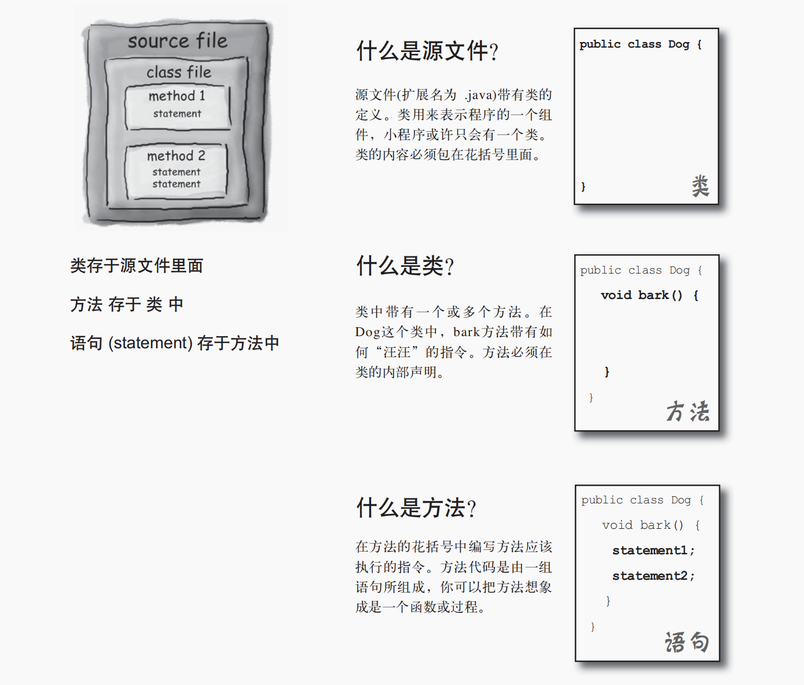

## 如果想要在A包调用B包的属性/方法，属性/方法要写在public class 公共类中

错误示范

在 com.modifier.C将属性和方法写到非public class 中

然后在com.use.test中尝试调用属性方法

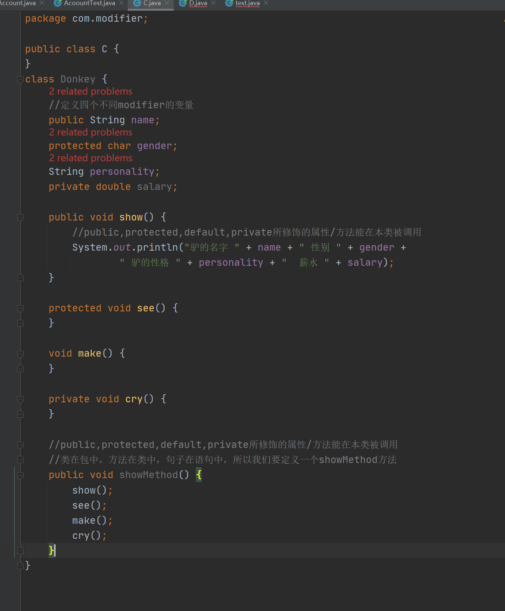

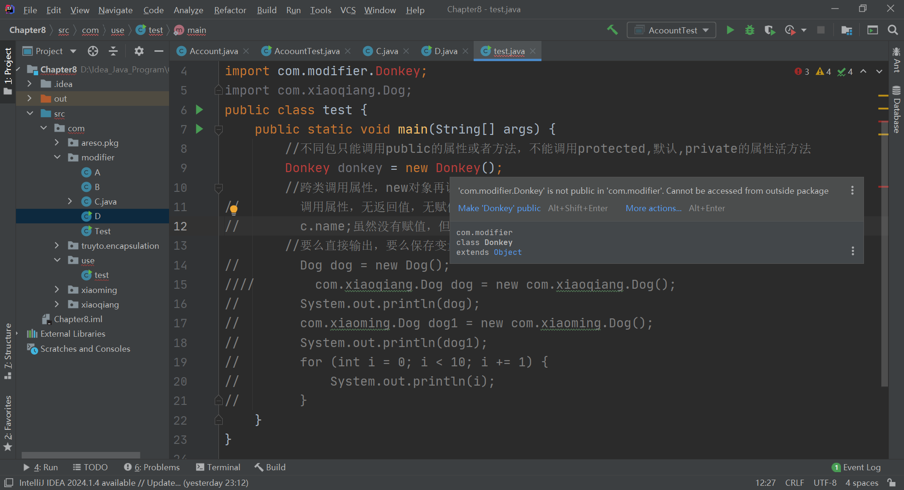

**正确示范**

属性/方法在public class中

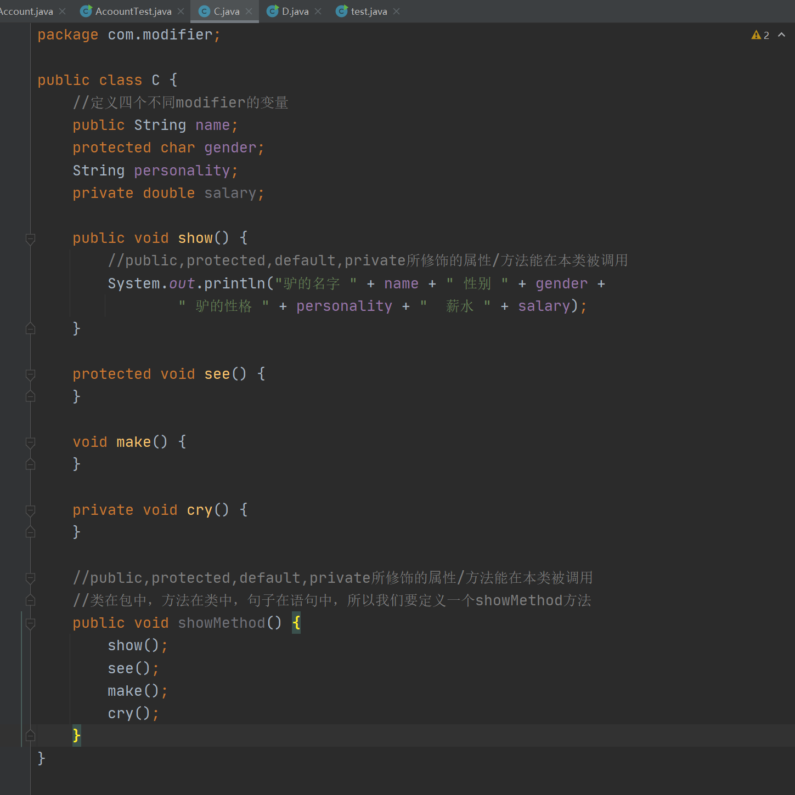

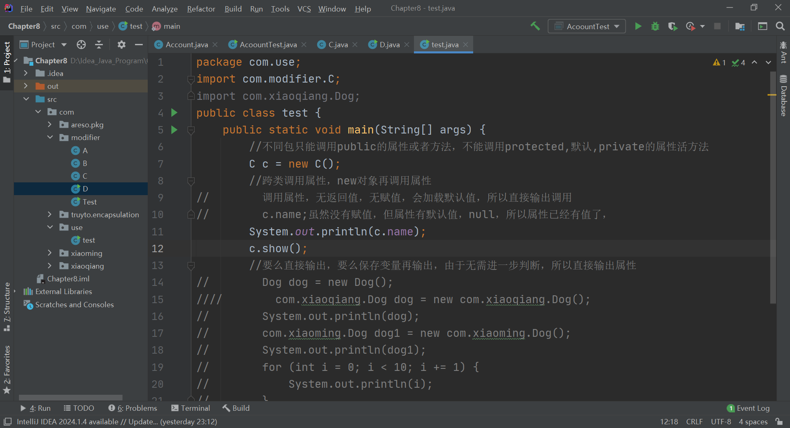

​			（用到的文件包名为com.modifier C /com.modifier D / com.use.test）

### 子类与父类的理解

普通理解：爸爸的爸爸是爷爷

- 父类（基类，超类）：保存两个类相同的属性和方法
- 子类（派生类）：保存两个类不同的属性和方法

数学理解：

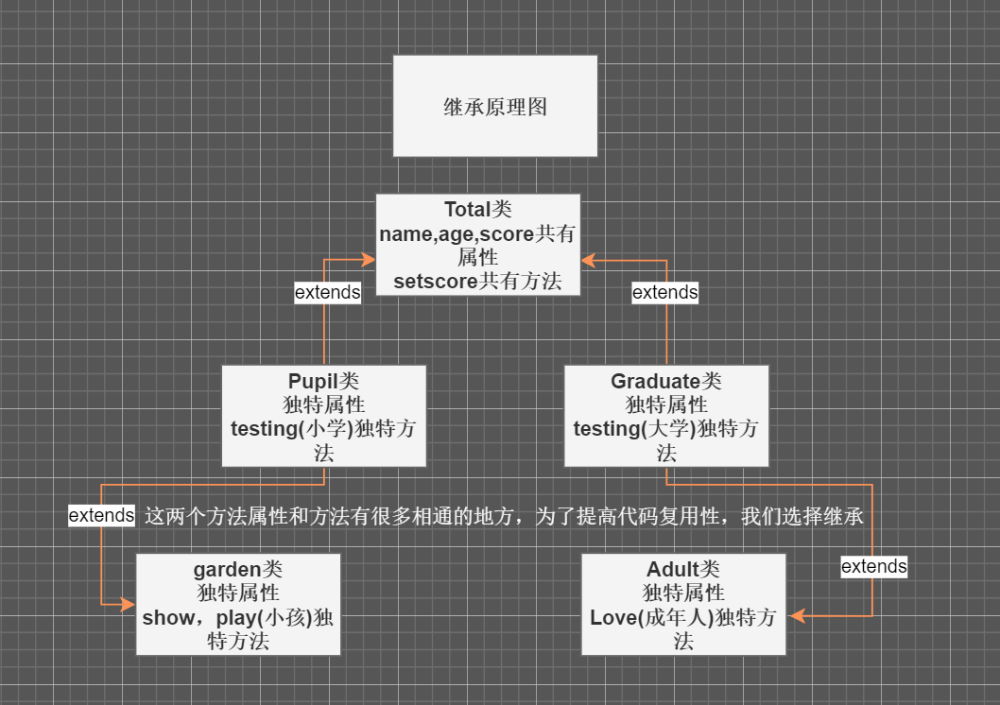

```
//假设把类看成集合，属性和方法看成集合的元素
    //Pupil =    {name,age,score,setScore,testing1};
    //Graduate = {name,age,score,setScore,testing2};
    //Pupil ∩ Graduate = {name,age,score,setScore};
    //定义一个total集合/类-->父类，父类是存放两个类相同的属性和方法，不就是取两个"集合"的交集吗？
//   total(父类) = {name,age,score,setScore};
    //然后我们再让各集合保存自己特有的元素（属性/方法），这不就符合子类保存两个类属性/方法不同的属性/方法吗？
    //Garden子类1 -1 {name,age,score,setScore,testing1,play,selfAdmire};
    //Adult子类2 - 2{name,age,score,setScore,testing2,Love,Work};
    //Pupil(子类1) =    {testing1};   Garden(子类1 -1) = {play,selfAdmire};
    //Graduate(子类2) = {testing2};   Adult(子类2 - 2) = {Love,Work};
    //Pupil,Graduate,Garden,Adult集合是total集合的非空真子集（有total类没有的元素（属性/方法），
    // 而这些没有的属性和方法就保存到子类，共有的属性/方法（元素）保存到total集合（父类）中）
```

如果把Pupil类和Graduate类看成是集合，它们属性和方法看作是元素，父类集合本身就是子类集合的交集，子类是父类集合的非空真子集，所以子类的元素包含父类

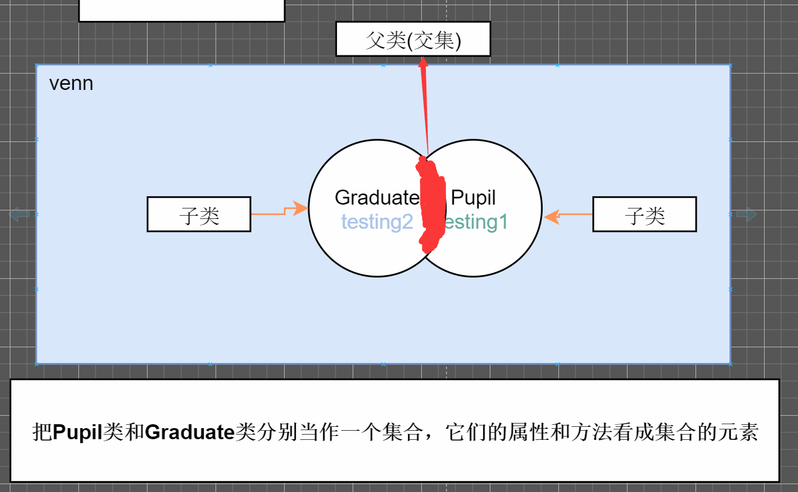

## 方法重载与方法重写区别

方法重载：方法名相同，形参列表不同，返回类型无要求，形参名无要求

方法重写：方法名相同，形参要求一致，返回类型要一致或者兼容，

|   名称   | 发生范围                      | 方法名 |             形参列表             |                    返回类型                     |                访问修饰符                |
| :------: | ----------------------------- | :----: | :------------------------------: | :---------------------------------------------: | :--------------------------------------: |
| 方法重载 | 本类                          |  相同  | 个数、顺序、数据类型至少一个不同 |                     无要求                      |                  无要求                  |
| 方法重写 | 父（直接/上级类）子类（继承） |  相同  |               相同               | 子类方法的返回类型要和父类方法返回类型一致/兼容 | 子类的范围范围不能缩小父类方法的访问范围 |


## This与super关键字区别

This 指的是当前调用的对象的成员（属性/方法）

super 指的是父类（直接/上级类）的成员（属性/方法）

## 继承中子类巧调父类的方法，将信息一同输出

父类有两个私有属性 name 和 age ，还有个返回name 和 age的字符串方法；一个有参构造器

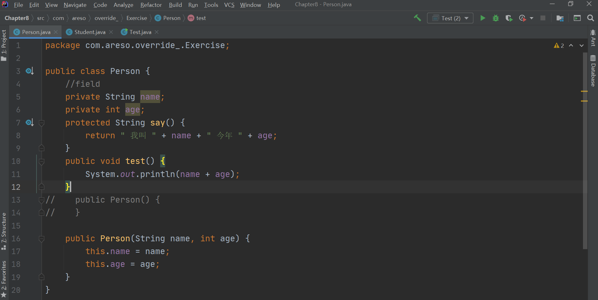

子类继承父类的属性，有特有属性，私有的 id 和 score，也有个返回字符串的方法，与父类的字符串方法构成**方法重写**

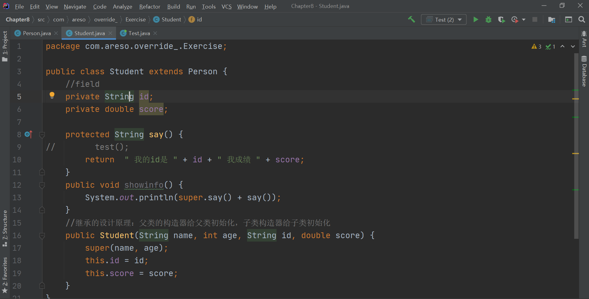

要求在test类输出父类和子类的信息，**传统方法，分别创建对象再输出，但这不满足继承**

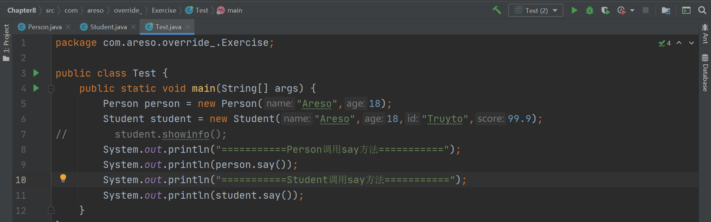

**所以引出我们继承中通过子类巧调父类的方法来达到继承**

1. 不newPerson对象

2. 在子类创建一个返回字符串的（因为父类和子类的重写方法都是返回一个字符串）showInfo方法

   方法体内 为 super.say(查找父类的say方法) + say/this.say(先从本类查找say方法)

3. 在test中new person对象 然后直接调用showInfo方法就完成继承方法的输出信息

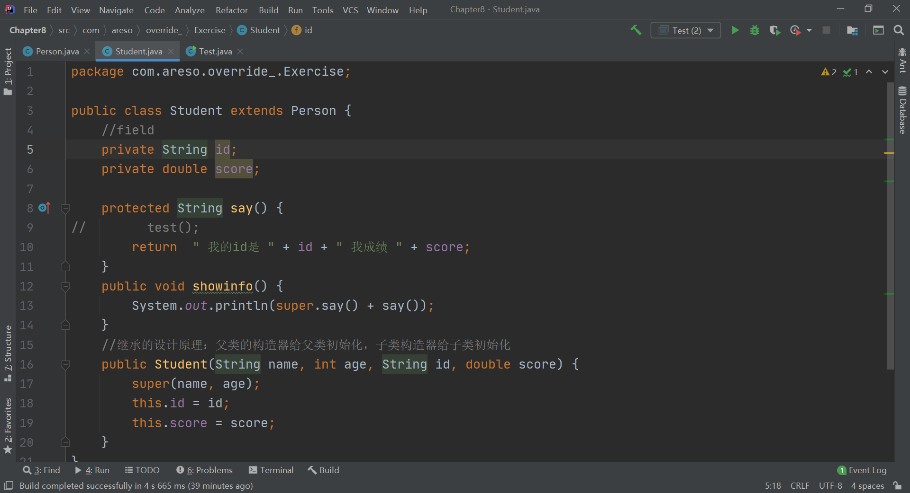

​									      子类

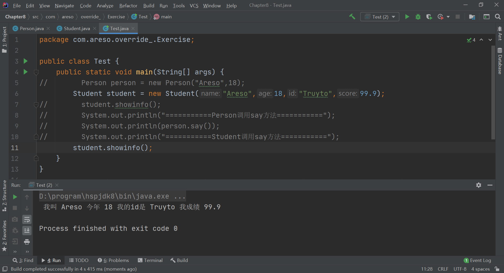

​											test类

优雅~

## 如果属性没有要求，建议都设置为私有化

## 多态数组

定义：父类类型作为数组类型，子类类型作为数组的具体元素

##### 1.动态数组的静态初始化(一维数组)

父类类型[] 数组名 = {子类引用所指向的子类对象};

```java
package com.areso.Polymorphic_.Polyarr_;
public class ReviewPloyArr {
    public static void main(String[] args) {
        //创建对应对象调用子类/父类对象构造器，给它们完成初始化
        Person gg = new Person("GG棒", 8);
        Student student = new Student("张六", 21, 99.9);
        Teacher teacher = new Teacher("思雨", 19, 2700);
        //多态数组：父类类型作为数组类型，子类类型作为数组的具体元素
        Person[] people = {gg,student,teacher};//一维数组静态初始化
        //for循环遍历多态数组
        for (int i = 0; i < people.length; i++) {
            //有返回值方法，无需判断-->直接输出
            System.out.println(people[i].showInfo());
        }
      }
}
```

##### 2.多态数组动态初始化（一维数组）

父类类型[] 数组名  = new 父类类型[];

```java
package com.areso.Polymorphic_.Polyarr_;
public class ReviewPloyArr {
    public static void main(String[] args) {
        //创建对应对象调用子类/父类对象构造器，给它们完成初始化
        Person gg = new Person("GG棒", 8);
        Student student = new Student("张六", 21, 99.9);
        Teacher teacher = new Teacher("思雨", 19, 2700);
        System.out.println("===============多态数组动态初始化================");
        //动态初始化-一维数组
        Person[] people1 = new Person[2];
        people1[0] = student;
        people1[1] = teacher;
        for (int i = 0; i < people1.length; i++) {
            System.out.println(people1[i].showInfo());
        }
    }
}
```

如果是学生类，调用study方法；如果是Teacher类调用 teach方法（ 运行类型 instance of 某个类型/某个类型子类）

```java
package com.areso.Polymorphic_.Polyarr_;
public class ReviewPloyArr {
    public static void main(String[] args) {
        //创建对应对象调用子类/父类对象构造器，给它们完成初始化
        Person gg = new Person("GG棒", 8);
        Student student = new Student("张六", 21, 99.9);
        Teacher teacher = new Teacher("思雨", 19, 2700);
        //多态数组：父类类型作为数组类型，子类类型作为数组的具体元素
        Person[] people = {gg,student,teacher};//一维数组静态初始化
        //for循环遍历多态数组
        for (int i = 0; i < people.length; i++) {
            //有返回值方法，无需判断-->直接输出
            System.out.println(people[i].showInfo());
        }
        System.out.println("===============多态数组动态初始化================");
        //动态初始化-一维数组
        Person[] people1 = new Person[2];
        people1[0] = student;
        people1[1] = teacher;
        for (int i = 0; i < people1.length; i++) {
            System.out.println(people1[i].showInfo());
            //如果是学生调用study方法，如果是老师调用teach方法
            if(people1[i] instanceof Student) {//向上转型
                //多态--向下转型
                //方法1
                Student student1 = (Student)people1[i];
                student1.study();
                //方法2
                ((Student)people1[i]).study();
            }else if(people1[i] instanceof  Teacher) {
                ((Teacher) people1[i]).teach();
            }else {
                System.out.println("没有这个类捏~");
            }
        }
    }
}
```

​						

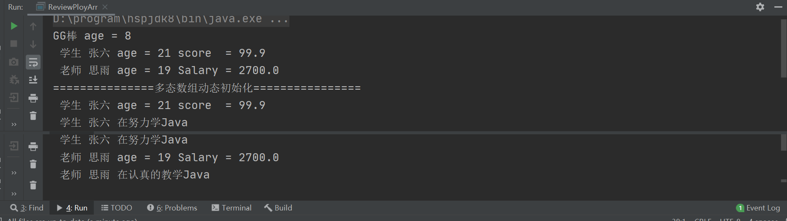

## equals细节理解

equals细节：Object的equals方法默认是比较地址的

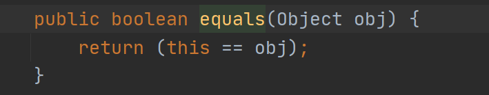

Object的**子类会重写equals方法，注意！这里的子类会重写方法指的是默认的子类，如果是我们自定义的类Person，也是Object的子类，但是Person内没有重写equals方法，要自己定义**

未重写equals

​									测试类

```java
package com.areso.Object_.equals_;

public class EqualsExercise01 {
    public static void main(String[] args) {
        Person person = new Person("高野千鹤", 17, '女');
//        Person person1 = new Person("西南", 25, '男');
        Person person1 = new Person("高野千鹤", 17, '女');

        //Person类没有重写equals，Person继承Object默认的equals方法，比较两个对象的地址是否相同
        System.out.println(person.equals(person1));//false
    }
}
--------------------------------------------------------------------------------------------------
package com.areso.Object_.equals_;
public class Person {
    private String name;
    private int age;
    private char gender;
     public Person(String name, int age, char gender) {
        this.name = name;
        this.age = age;
        this.gender = gender;
    }

    public String getName() {
        return name;
    }

    public void setName(String name) {
        this.name = name;
    }

    public int getAge() {
        return age;
    }

    public void setAge(int age) {
        this.age = age;
    }

    public char getGender() {
        return gender;
    }

    public void setGender(char gender) {
        this.gender = gender;
    }
}
```

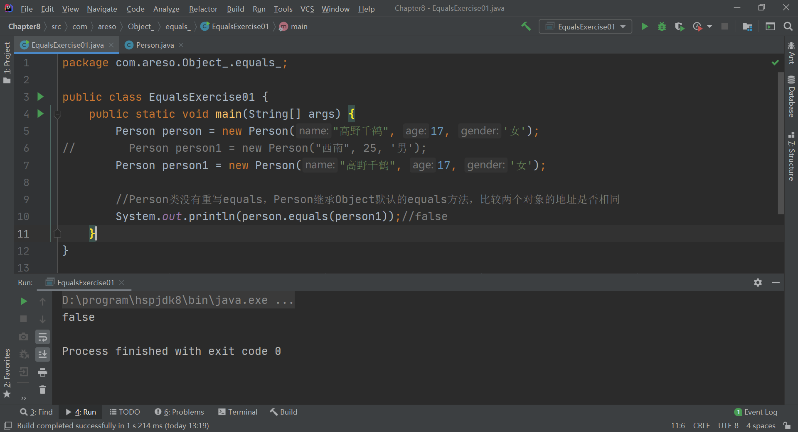

自己重写equals

判断两个对象内容相同：

1. 括号外对象(this),括号内对象，指向同一个数据空间
2. 括号内对象要是相同类型（instance of）

```java
 public boolean equals(Object obj) {
        //如果括号外对象和括号内对象是指向同一数据空间 返回true
        if(this == obj) {
            return true;
        }
        //obj是Person对象才判断
        if(obj instanceof Person) {
            //向下转型调用子类对象的成员
            Person p = (Person)obj;
            return this.name.equals(p.name) && this.age == p.age && this.gender == p.gender;
            //this 指向括号外的对象， p.name 指的是括号内的对象
        }
        //obj不是Person对象 返回false
        return false;
    }
```


巧用模板

1000.for

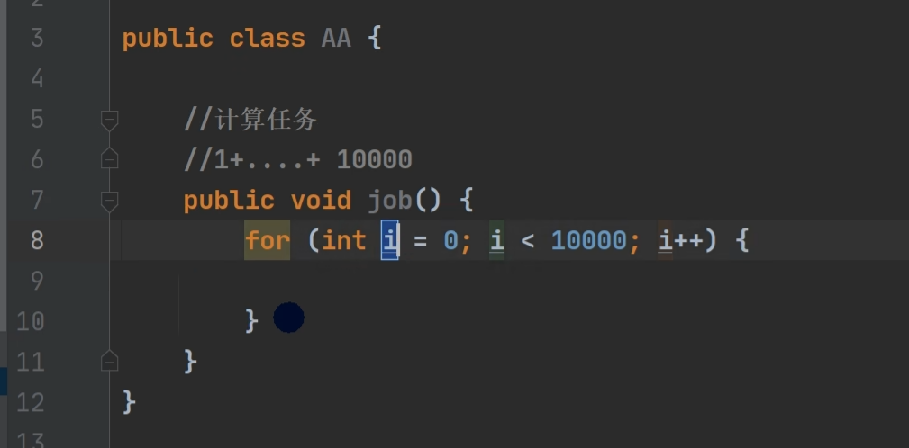

## ArrayList和Vector区别

| 名称      | 底层     | 版本   | 线程安全/效率  | 扩容机制                                                     |
| --------- | -------- | ------ | -------------- | ------------------------------------------------------------ |
| ArrayList | 可变数组 | jdk1.3 | 不安全，效率高 | 1)调用无参构造器，第一次为10；第二次为第一次的1.5倍以此类推；调用有参构造器，第一次为指定大小，满了，第二次扩容为指定大小的1.5倍 |
| Vector    | 可变数组 | jdk1.0 | 安全，效率低   | 2)调用无参构造器，默认为10；满了，第二次扩容 第一次的2倍；调用有参构造器，容量为指定大小，满了，第二次扩容为指定da'x |


## Collection / List / Set 的遍历方式 及原因

|     名称     |                 遍历方式                  |                             原因                             |
| :----------: | :---------------------------------------: | :----------------------------------------------------------: |
|  Colleciton  |     iterator 【itit】 / 增强for【I】      |    Colleciton继承Iterable接口，增强for是简化版的iterator     |
| List【有序】 | iterator 【itit】 / 增强for【I】/ 普通for | List是Colleciotn重要的子接口，List接口有get方法可以获取索引的对应内容 |
| Set【无序】  |     iterator 【itit】 / 增强for【I】      |   Set是Colleciotn重要的子接口, Colleciotn继承Iterable接口    |

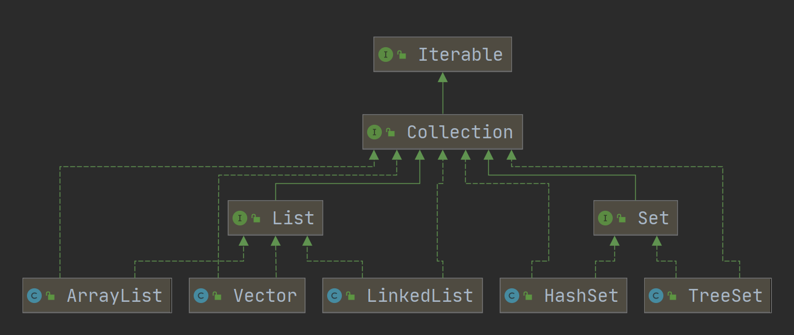

## 多思考这个地方为什么要用这个东东

比如坦克大战中，存储敌人坦克的对象为什么不用数组而用集合。

### **原因：**

​	1.数组有三个不足之处：

​		1.1 定义数组时就要设置长度

​		1.2 只能存放同类型的数据

​		1.3 添加和删除数组元素很麻烦 比如添加，要先创建一个数组,for循环遍历然后将原数组的元素拷贝到新数组。

### resolve method：使用集合

- 集合可以动态的添加对象
- 提供了一系列的方法来操作对象,比如add，remove，set
- 添加和删除元素简单


### ListExr2反思：

- 在创建ArrayList集合时没有通过泛型指定添加的元素类型，导致for循环通过集合的get(int index)方法获取对象时无法获取对象对应的属性，因为get(int index)默认返回的是一个object对象【当然也可以使用多态向下转型，不过得转两次，使用泛型是最优解】
- 集合元素之间调换位置用set(int index,Object obj) 数组之间的调换通过设置一个辅助变量count来进行交换

```java
/**
 * @author Areso
 * @version 1.7
 */
@SuppressWarnings({"all"})
public class ListExr2 {
    public static void main(String[] args) {
        ArrayList<Book>list = new ArrayList<Book>();
        list.add(new Book("幸福之路",7));
        list.add(new Book("活着",50));
        list.add(new Book("小王子",200));
        for(int i = 0; i < list.size()-1;i++) {
            for(int j = 0;j < list.size()-1-i;j++) {
                if(list.get(j).price > list.get(j+1).price) {
                    //通过使用set方法将两个元素的位置进行替换
                    list.set(j,list.get(j+1));
                    list.set(j+1,list.get(j));
                }
            }
        }
        for (int i = 0; i < list.size(); i++) {
            Book book = list.get(i);
            System.out.println(book);
        }
    }
}

```

使用多态向下转型

```java
public class ListExr2 {
    public static void main(String[] args) {
        ArrayList list = new ArrayList();
        list.add(new Book("幸福之路",7));
        list.add(new Book("活着",50));
        list.add(new Book("小王子",200));
        for(int i = 0; i < list.size()-1;i++) {
            for(int j = 0;j < list.size()-1-i;j++) {
                //也可以使用多态向下转型来获取Book对象属性
                Object o = list.get(j);
                Book b = (Book)o;
                Object o1 = list.get(j + 1);
                Book b1 = (Book)o1;
                if(b.price > b1.price) {
                    //通过使用set方法将两个元素的位置进行替换
                    //list.set(j,list.get(j+1));
                    //list.set(j+1,list.get(j));
                    list.set(j,o1);
                    list.set(j+1,o);
                }
            }
        }
        for (int i = 0; i < list.size(); i++) {
            Object obj = list.get(i);
            System.out.println(obj);
        }
    }
}
```


### 为什么要引入多态？

1. 降低代码的耦合度，提高代码的复用性

   - 看一个场景，我想看🐱和🐕的关于吃这个行为，在oop中，方法体现对象的行为。所以传统方法，我们就实例化类对应的对象，并通过对象名.方法()，调用对应的eat方法。

     ```java
     public class Test {
         public static void main(String[] args) {
             Cat cat = new Cat();
             Dog dog = new Dog();
             cat.eat();
             dog.eat();
         }
     }
     class Cat {
         public String name = "苏心";
         public void eat() {
             System.out.println(name + " 吃罐头~");
         }
     }
     class Dog {
         public String name = "旺财";
         public void eat() {
             System.out.println(name + " 吃罐头~");
         }
     }
     ```

   - 那么如果我要观察10个甚至是上百个动物的行为，难道我要实例化100个类的对象，并调用吗？显然不现实

   - 所以我们就引入多态【一个方法根据运行类型的不同能有多种调用，**即同一个方法在不同的对象中能表现出不同的行为**】

     ```java
     public class Test {
         public static void main(String[] args) {
     //        Cat cat = new Cat();
     //        Dog dog = new Dog();
     //        cat.eat();
     //        dog.eat();
             Animal animal = new Cat("苏七","鱼儿");
             animal = new Dog("旺财","骨头");
             animal.eat();
             //多态中，调用方法看运行类型，编译类型是一开始就定义好的了不能改变，运行类型可改变
         }
     }
     class Cat extends Animal{
         public Cat(String name, String food) {
             super(name, food);
         }
     }
     class Dog extends Animal{
         public Dog(String name, String food) {
             super(name, food);
         }
     }
     /*父类/基类*/
     class Animal {
         private String name;
         private String food;
     
         public Animal(String name, String food) {
             this.name = name;
             this.food = food;
         }
     
         public void eat() {
             System.out.println(name + "吃" + food);
         }
     
         public String getName() {
             return name;
         }
     
         public void setName(String name) {
             this.name = name;
         }
     
         public String getFood() {
             return food;
         }
     
         public void setFood(String food) {
             this.food = food;
         }
     }
     
     ```

     > 运行结果：
     >
     > 苏七吃鱼儿
     >
     > 旺财吃骨头
